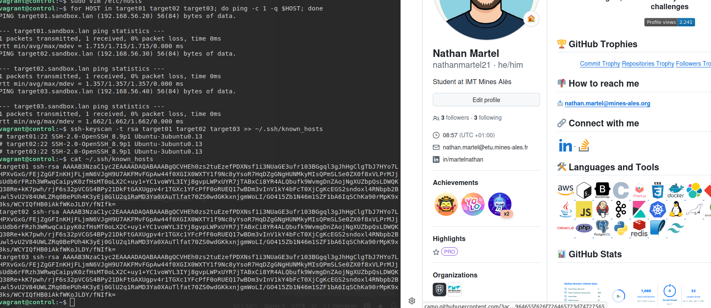
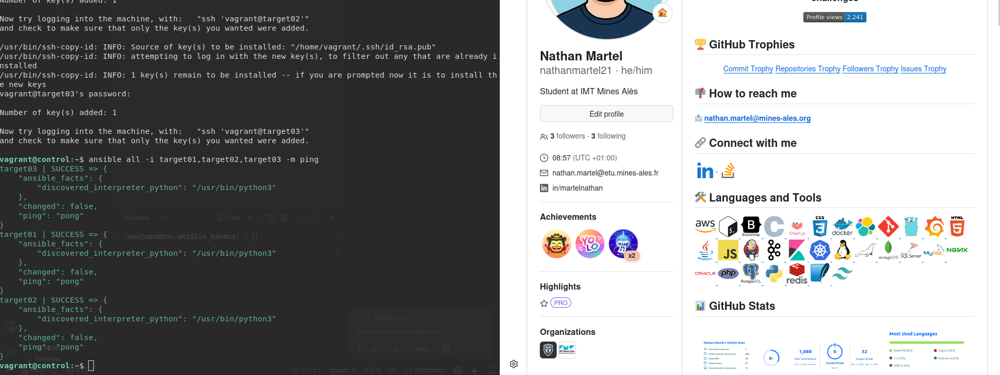

# Atelier-03 : Authentification sur les Target Hosts

⚠️ **Ce document est classifié sous TLP: RED**

---

## Description

Cet atelier pratique a pour objectif de mettre en place l'authentification sur les machines.

## Démarrage des machines virtuelles

Depuis le répertoire `atelier-03`, j’ai démarré les machines virtuelles avec la commande suivante :

```bash
$ vagrant up
```

Cette commande démarre les machines `control`, `target01`, `target02` et `target03`.

## Connexion au Control Host

Une fois les VM démarrées, je me suis connecté au Control Host avec :

```bash
$ vagrant ssh control
```

## Édition du fichier /etc/hosts

L'environnement ne fournit pas de résolution DNS. Étant donné qu'il vaut mieux travailler avec des noms d'hôtes qu'avec des adresses IP, j’ai édité le fichier `/etc/hosts` du Control Host avec `vim` :

```bash
$ sudo vim /etc/hosts
```

J’ai ajouté les lignes suivantes :

```bash
192.168.56.10  control.sandbox.lan  control
192.168.56.20  target01.sandbox.lan  target01
192.168.56.30  target02.sandbox.lan  target02
192.168.56.40  target03.sandbox.lan  target03
```

## Test de la connectivité réseau de base

J’ai testé la connectivité de base des VMs avec :

```bash
$ for HOST in target01 target02 target03; do ping -c 1 -q $HOST; done
```

Le résultat indique 0% packet loss pour chaque machine.

## Collecte des clés SSH publiques des Target Hosts

J’ai collecté les clés SSH publiques des Target Hosts :

```bash
$ ssh-keyscan -t rsa target01 target02 target03 >> ~/.ssh/known_hosts
```

J’ai vérifié que les clés ont bien été ajoutées :

```bash
$ cat ~/.ssh/known_hosts
```



## Génération d'une paire de clés SSH

J’ai généré une paire de clés SSH en acceptant toutes les options par défaut :

```bash
$ ssh-keygen
```

La clé publique est sauvegardée dans `~/.ssh/id_rsa.pub` et la clé privée dans `~/.ssh/id_rsa`.

## Distribution de la clé publique sur les Target Hosts

J’ai distribué la clé publique sur mes Target Hosts en fournissant à chaque fois le mot de passe par défaut `vagrant` :

```bash
$ ssh-copy-id vagrant@target01
$ ssh-copy-id vagrant@target02
$ ssh-copy-id vagrant@target03
```

## Test du ping Ansible

Pour vérifier que tout fonctionne, j’ai exécuté un ping Ansible :

```bash
$ ansible all -i target01,target02,target03 -m ping
```

Le résultat indique un succès pour chaque Target Host :



## Arrêt des machines virtuelles

Enfin, j’ai quitté le Control Host et supprimé toutes les VM :

```bash
$ exit
$ vagrant destroy -f
```

## Auteur

> @uthor : Nathan Martel, étudiant en deuxième année à l'École des Mines d'Alès.

---

**TLP: RED** - Ce document markdown est classifié sous la marque TLP: RED
