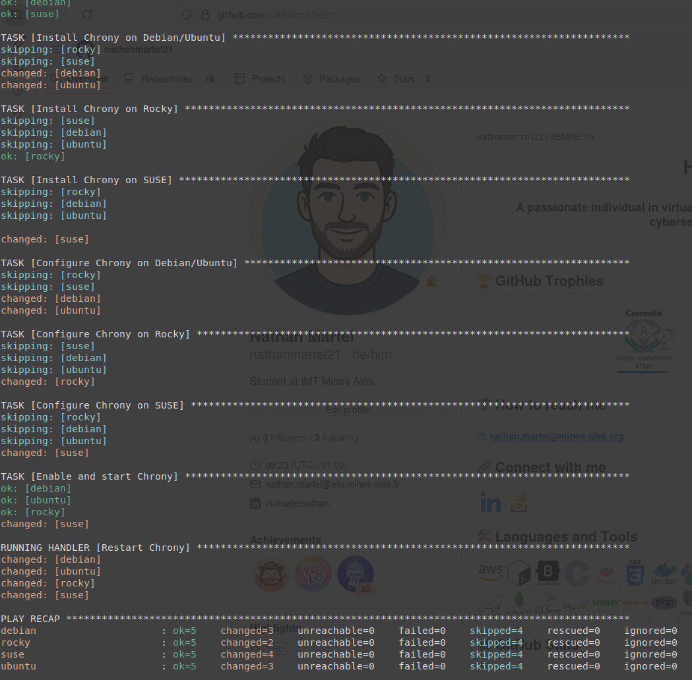
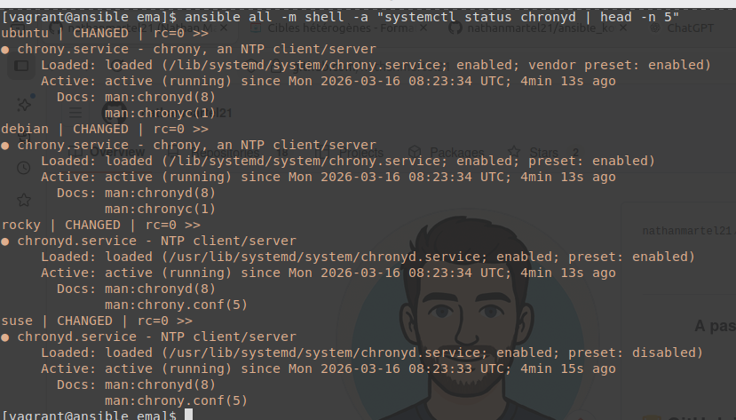
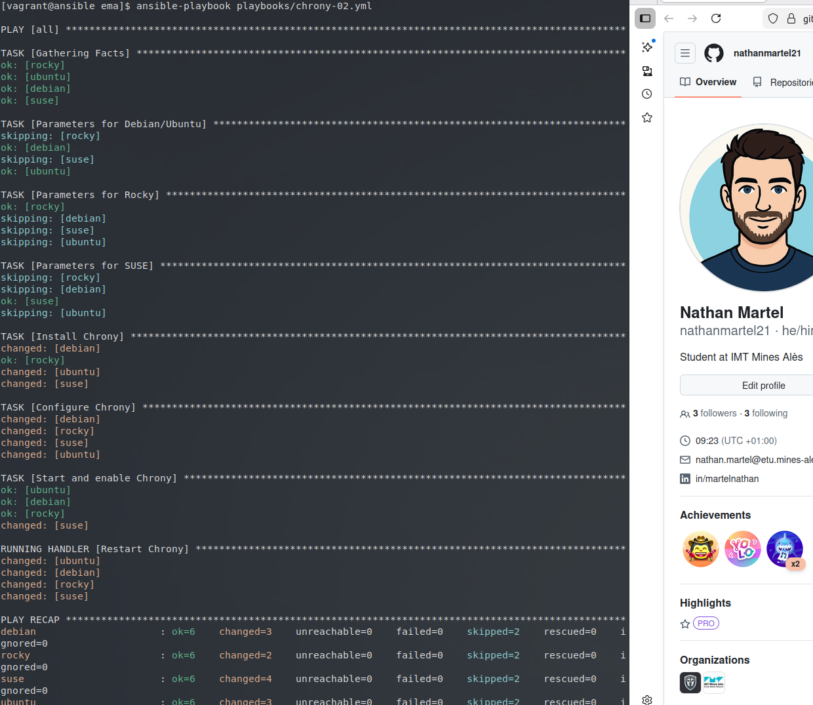
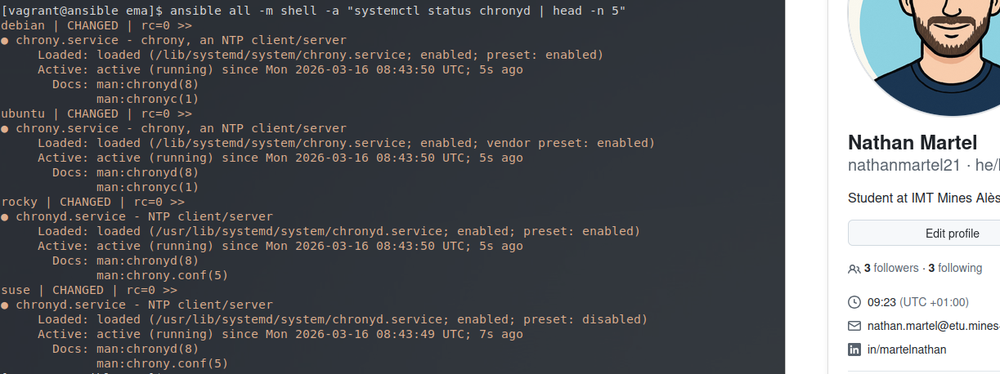

# Atelier-17 : Cibles hétérogènes

⚠️ **Ce document est classifié sous TLP: RED**

---

## Description

Cet atelier pratique a pour objectif d'apprendre à gérer des **Target Hosts hétérogènes** avec Ansible. L'enjeu est de déployer et configurer le service de synchronisation NTP via `chrony` sur plusieurs distributions Linux différentes (Debian, Ubuntu, Rocky Linux et SUSE Linux) en adaptant dynamiquement l'exécution selon les spécificités du système cible (nom du paquet, nom du service, emplacement du fichier de configuration).

J'ai exploré deux méthodes :
1. **La méthode explicite (les "gros sabots")** : en utilisant les modules spécifiques à chaque gestionnaire de paquets (`apt`, `dnf`, `zypper`) avec des conditions `when`.
2. **La méthode subtile avec des variables** : en définissant dynamiquement les paramètres du système avec `set_fact` avant d'utiliser des modules génériques comme `package`.

## Démarrage des machines virtuelles

Depuis le répertoire de l'atelier, j'ai démarré les machines virtuelles avec la commande suivante :

```bash
$ vagrant up
```

Cinq machines virtuelles sont initialisées pour ce laboratoire :

| Machine virtuelle | Adresse IP     | Distribution  |
|-------------------|----------------|---------------|
| ansible           | 192.168.56.10  | Control Host  |
| rocky             | 192.168.56.20  | Rocky Linux   |
| debian            | 192.168.56.30  | Debian        |
| suse              | 192.168.56.40  | SUSE Linux    |
| ubuntu            | 192.168.56.50  | Ubuntu        |

## Connexion au Control Host et accès au projet

Je me suis connecté au Control Host avec la commande suivante :

```bash
$ vagrant ssh ansible
```

Une fois connecté, j'ai navigué vers le répertoire du projet Ansible :

```bash
$ cd ansible/projets/ema/
```

L'environnement `direnv` s'est chargé automatiquement.

---

## Méthode 1 : Approche directe (Les "gros sabots")

J'ai d'abord créé un premier playbook `playbooks/chrony-01.yml` qui différencie explicitement chaque tâche en fonction de la famille (`ansible_os_family`) ou de la distribution (`ansible_distribution`).

```yaml
---
- hosts: all
  become: true

  tasks:

    - name: Install Chrony on Debian/Ubuntu
      apt:
        name: chrony
        state: present
        update_cache: true
      when: ansible_os_family == "Debian"

    - name: Install Chrony on Rocky
      dnf:
        name: chrony
        state: present
      when: ansible_distribution == "Rocky"

    - name: Install Chrony on SUSE
      zypper:
        name: chrony
        state: present
      when: ansible_distribution == "openSUSE Leap"

    - name: Configure Chrony on Debian/Ubuntu
      copy:
        dest: /etc/chrony/chrony.conf
        content: |
          server 0.fr.pool.ntp.org iburst
          server 1.fr.pool.ntp.org iburst
          server 2.fr.pool.ntp.org iburst
          server 3.fr.pool.ntp.org iburst
          driftfile /var/lib/chrony/drift
          makestep 1.0 3
          rtcsync
          logdir /var/log/chrony
      notify: Restart Chrony
      when: ansible_os_family == "Debian"

    - name: Configure Chrony on Rocky
      copy:
        dest: /etc/chrony.conf
        content: |
          server 0.fr.pool.ntp.org iburst
          server 1.fr.pool.ntp.org iburst
          server 2.fr.pool.ntp.org iburst
          server 3.fr.pool.ntp.org iburst
          driftfile /var/lib/chrony/drift
          makestep 1.0 3
          rtcsync
          logdir /var/log/chrony
      notify: Restart Chrony
      when: ansible_distribution == "Rocky"

    - name: Configure Chrony on SUSE
      copy:
        dest: /etc/chrony.conf
        content: |
          server 0.fr.pool.ntp.org iburst
          server 1.fr.pool.ntp.org iburst
          server 2.fr.pool.ntp.org iburst
          server 3.fr.pool.ntp.org iburst
          driftfile /var/lib/chrony/drift
          makestep 1.0 3
          rtcsync
          logdir /var/log/chrony
      notify: Restart Chrony
      when: ansible_distribution == "openSUSE Leap"

    - name: Enable and start Chrony
      service:
        name: chronyd
        state: started
        enabled: true

  handlers:

    - name: Restart Chrony
      service:
        name: chronyd
        state: restarted
```

J'ai vérifié la syntaxe du playbook et je l'ai exécuté :

```bash
$ yamllint playbooks/chrony-01.yml
$ ansible-playbook playbooks/chrony-01.yml
```

Résultat de l'exécution :



Pour vérifier la bonne prise en compte, j'ai vérifié le statut du service avec le module `shell` :

```bash
$ ansible all -m shell -a "systemctl status chronyd | head -n 5"
```

Chaque machine cible a renvoyé un statut `active (running)`, validant que le service est bien déployé : 



---

## Réinitialisation de l'environnement

Afin de tester la deuxième méthode sur des machines vierges, j'ai détruit et recréé l'infrastructure :

```bash
$ vagrant destroy -f
$ vagrant up
$ vagrant ssh ansible
$ cd ~/ansible/projets/ema
```

---

## Méthode 2 : Approche avec `set_fact`

La première méthode s'avérant très redondante, j'ai créé un second playbook `playbooks/chrony-02.yml`. Cette fois-ci, j'ai utilisé la directive `set_fact` pour associer les valeurs de configuration spécifiques à la distribution dans des variables au début du playbook. 

Grâce à cela, l'installation, la configuration et le démarrage peuvent se faire via des modules génériques (`package`, `service`) en appelant les variables.

```yaml
---
- hosts: all
  become: true

  tasks:

    - name: Parameters for Debian/Ubuntu
      set_fact:
        chrony_package: chrony
        chrony_service: chrony
        chrony_confdir: /etc/chrony
      when: ansible_os_family == "Debian"

    - name: Parameters for Rocky
      set_fact:
        chrony_package: chrony
        chrony_service: chronyd
        chrony_confdir: /etc
      when: ansible_distribution == "Rocky"

    - name: Parameters for SUSE
      set_fact:
        chrony_package: chrony
        chrony_service: chronyd
        chrony_confdir: /etc
      when: ansible_distribution == "openSUSE Leap"

    - name: Install Chrony
      package:
        name: "{{ chrony_package }}"
        state: present

    - name: Configure Chrony
      copy:
        dest: "{{ chrony_confdir }}/chrony.conf"
        content: |
          server 0.fr.pool.ntp.org iburst
          server 1.fr.pool.ntp.org iburst
          server 2.fr.pool.ntp.org iburst
          server 3.fr.pool.ntp.org iburst
          driftfile /var/lib/chrony/drift
          makestep 1.0 3
          rtcsync
          logdir /var/log/chrony
      notify: Restart Chrony

    - name: Start and enable Chrony
      service:
        name: "{{ chrony_service }}"
        state: started
        enabled: true

  handlers:

    - name: Restart Chrony
      service:
        name: "{{ chrony_service }}"
        state: restarted
```

J'ai vérifié la syntaxe du playbook et je l'ai exécuté :

```bash
$ yamllint playbooks/chrony-02.yml
$ ansible-playbook playbooks/chrony-02.yml
```

Résultat de l'exécution :



J'ai ensuite vérifié à nouveau que l'installation a bien fonctionné de la même façon que précédemment :

```bash
$ ansible all -m shell -a "systemctl status chronyd | head -n 5"
```



Avec `set_fact` et les modules génériques est bien plus propre et élégante. Elle permet d'alléger le code de déploiement en le centralisant.

---

## Arrêt des machines virtuelles

Une fois l'atelier terminé, j’ai quitté le Control Host et supprimé toutes les VM pour nettoyer l'environnement :

```bash
$ exit
$ vagrant destroy -f
```

## Auteur

> @uthor : Nathan Martel, étudiant en deuxième année à l'École des Mines d'Alès.

---

**TLP: RED** - Ce document markdown est classifié sous la marque TLP: RED
