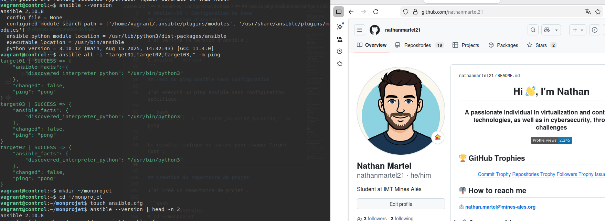
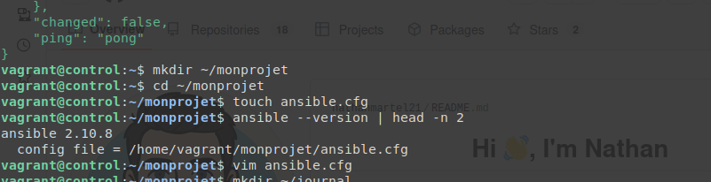
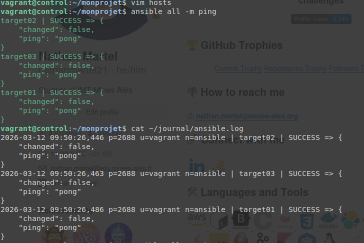
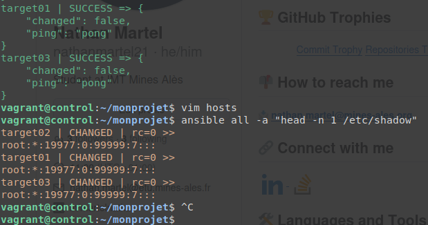

# Atelier-06 : Configuration de base

⚠️ **Ce document est classifié sous TLP: RED**

---

## Description

Cet atelier pratique a pour objectif de configurer Ansible de base, organiser les fichiers d'un projet Ansible et mettre en place la configuration de base.

## Démarrage des machines virtuelles

Depuis le répertoire `atelier-06`, j’ai démarré les machines virtuelles avec la commande suivante :

```bash
$ vagrant up
```

Cette commande démarre les machines `control`, `target01`, `target02` et `target03`.

## Connexion au Control Host

Une fois les VM démarrées, je me suis connecté au Control Host avec :

```bash
$ vagrant ssh control
```

## Édition du fichier /etc/hosts

J’ai édité le fichier `/etc/hosts` du Control Host avec `vim` pour ajouter les adresses IP et noms d'hôtes :

```bash
$ sudo vim /etc/hosts
```

J’ai ajouté les lignes suivantes :

```bash
192.168.56.10  control
192.168.56.20  target01
192.168.56.30  target02
192.168.56.40  target03
```

## Génération d'une paire de clés SSH

J’ai généré une paire de clés SSH en acceptant toutes les options par défaut :

```bash
$ ssh-keygen
```

La clé publique est sauvegardée dans `~/.ssh/id_rsa.pub` et la clé privée dans `~/.ssh/id_rsa`.

## Distribution de la clé publique sur les Target Hosts

J’ai distribué la clé publique sur mes Target Hosts :

```bash
$ ssh-copy-id vagrant@target01
$ ssh-copy-id vagrant@target02
$ ssh-copy-id vagrant@target03
```

J’ai testé la connexion SSH sans mot de passe :

```bash
$ ssh target01
$ exit
```

## Installation d'Ansible

J’ai mis à jour les paquets et installé Ansible :

```bash
$ sudo apt update
$ sudo apt install ansible -y
```

J’ai vérifié la version d'Ansible :

```bash
$ ansible --version
```

## Test du ping Ansible sans configuration

J’ai exécuté un ping Ansible sans configuration spécifique :

```bash
$ ansible all -i "target01,target02,target03," -m ping
```

Le résultat indique un succès pour chaque Target Host : 



## Création du répertoire de projet

J’ai créé un répertoire de projet :

```bash
$ mkdir ~/monprojet
$ cd ~/monprojet
```

## Création du fichier ansible.cfg

J’ai créé un fichier vide `ansible.cfg` :

```bash
$ touch ansible.cfg
```

J’ai vérifié que ce fichier est pris en compte :

```bash
$ ansible --version | head -n 2
```



## Création du répertoire pour les logs

J’ai créé un répertoire pour les logs :

```bash
$ mkdir ~/journal
```

## Édition du fichier ansible.cfg

J’ai édité `ansible.cfg` avec `vim` pour ajouter la configuration :

```bash
$ vim ansible.cfg
```

Contenu du fichier :

```ini
[defaults]
inventory = ./hosts
log_path = ~/journal/ansible.log
```

## Création du fichier d'inventaire hosts

J’ai créé le fichier `hosts` :

```bash
$ vim hosts
```

Contenu du fichier :

```ini
[testlab]
target01
target02
target03

[testlab:vars]
ansible_user=vagrant
ansible_become=yes
```

## Test du ping avec l'inventaire

J’ai testé le ping avec l'inventaire :

```bash
$ ansible all -m ping
```

Le résultat indique un succès pour chaque Target Host.

## Vérification de la journalisation

J’ai vérifié que les logs sont écrits :

```bash
$ cat ~/journal/ansible.log
```



## Test d'une commande avec élévation des droits

J’ai exécuté une commande nécessitant des droits élevés :

```bash
$ ansible all -a "head -n 1 /etc/shadow"
```

Le résultat indique un succès pour chaque Target Host.



## Arrêt des machines virtuelles

Enfin, j’ai quitté le Control Host et supprimé toutes les VM

```bash
$ exit
$ vagrant destroy -f
```

## Auteur

> @uthor : Nathan Martel, étudiant en deuxième année à l'École des Mines d'Alès.

---

**TLP: RED** - Ce document markdown est classifié sous la marque TLP: RED