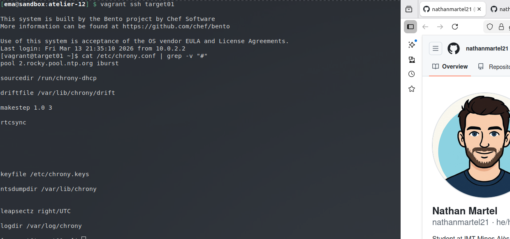
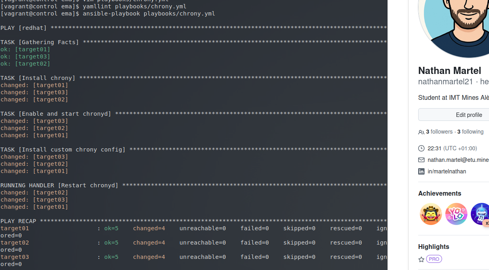
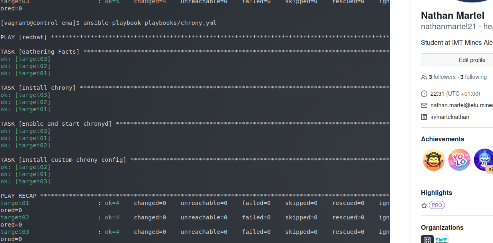
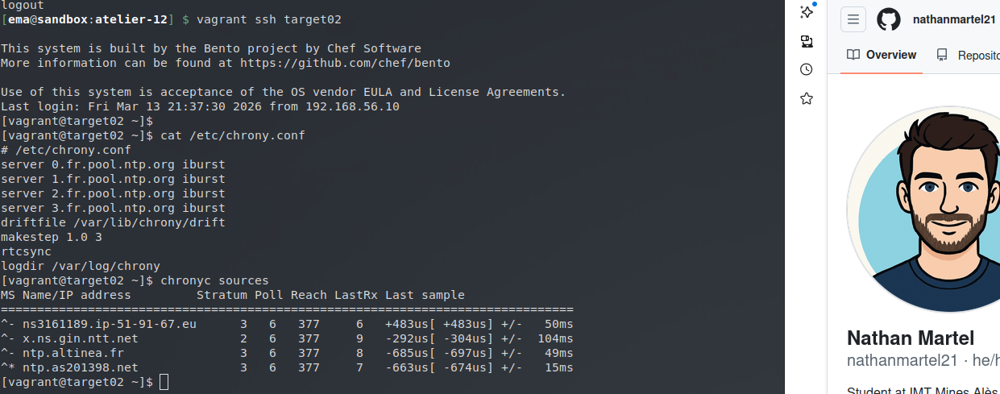

# Atelier-12 : Les handlers Ansible

⚠️ **Ce document est classifié sous TLP: RED**

---

## Description

Cet atelier pratique a pour objectif de voir un nouveau concept fondamental d'Ansible : les **handlers**. L'idée est de configurer la synchronisation NTP via le service `chronyd` sur quelques machines sous Rocky Linux. Le service ne doit être redémarré que si sa configuration a été modifiée.

## Démarrage des machines virtuelles

Depuis le répertoire `atelier-12`, j'ai démarré les machines virtuelles avec la commande suivante :

```bash
$ vagrant up
```

Quatre machines virtuelles sont initialisées pour ce laboratoire :

| Machine virtuelle | Adresse IP     | Distribution  |
|-------------------|----------------|---------------|
| control           | 192.168.56.10  | Control Host  |
| target01          | 192.168.56.20  | Rocky Linux   |
| target02          | 192.168.56.30  | Rocky Linux   |
| target03          | 192.168.56.40  | Rocky Linux   |

## Connexion au Control Host et accès au projet

Je me suis connecté au Control Host avec la commande suivante :

```bash
$ vagrant ssh control
```

Une fois connecté, j'ai navigué vers le répertoire du projet Ansible :

```bash
$ cd ansible/projets/ema/
```

L'environnement `direnv` s'est chargé automatiquement. L'inventaire définit le groupe `[redhat]` contenant les trois Target Hosts.

J'ai vérifié la connectivité aux machines du groupe `redhat` avec un ping Ansible :

```bash
$ ansible redhat -m ping
```

Le résultat m'a confirmé que la connexion était opérationnelle (`pong`).

---

## Vérification de la configuration initiale

Avant d'appliquer ma propre configuration, j'ai vérifié la configuration par défaut de `chrony` sur l'une des cibles (sans afficher les commentaires) :

```bash
$ ssh target01 "cat /etc/chrony.conf | grep -v '#'"
```

Voici un aperçu de la configuration de base :



---

## Création du playbook avec Handler

Ensuite, j'ai commencé par écrire le playbook `chrony.yml` :

```bash
$ vim playbooks/chrony.yml
```

Dans ce playbook, j'ai ajouté une tâche pour installer `chrony`, une autre pour démarrer le service, et enfin une tâche de copie (module `copy`) pour injecter ma propre configuration. 
La directive `notify` est placée sur la tâche de copie afin d'appeler le `handler` uniquement si le fichier de configuration est modifié :

```yaml
---
- hosts: redhat

  tasks:
    - name: Install chrony
      dnf:
        name: chrony
        state: present

    - name: Enable and start chronyd
      service:
        name: chronyd
        state: started
        enabled: true

    - name: Install custom chrony config
      copy:
        dest: /etc/chrony.conf
        content: |
          # /etc/chrony.conf
          server 0.fr.pool.ntp.org iburst
          server 1.fr.pool.ntp.org iburst
          server 2.fr.pool.ntp.org iburst
          server 3.fr.pool.ntp.org iburst
          driftfile /var/lib/chrony/drift
          makestep 1.0 3
          rtcsync
          logdir /var/log/chrony
      notify: Restart chronyd

  handlers:
    - name: Restart chronyd
      service:
        name: chronyd
        state: restarted
```

*(Note : Le service `chronyd` n'acceptant pas l'état `reloaded`, j'ai dû utiliser l'état `restarted` dans le handler).*

---

## Exécution et déclenchement du Handler

Dans un premier temps, j'ai validé la syntaxe YAML de mon playbook :

```bash
$ yamllint chrony.yml
```

Aucune erreur n'étant remontée, j'ai lancé l'exécution du playbook :

```bash
$ ansible-playbook playbooks/chrony.yml
```

Lors de cette première exécution, la configuration a été modifiée (état `changed`), ce qui a logiquement déclenché le Handler `Restart chronyd` pour redémarrer le service et prendre en compte les changements :



---

## Vérification de l'idempotence

Pour m'assurer que l'idempotence et le mécanisme du Handler fonctionnent correctement, j'ai relancé exactement le même playbook :

```bash
$ !! 
$ ansible-playbook playbooks/chrony.yml
```

Cette fois-ci, la configuration étant déjà la bonne, l'état remonté est `ok`. Par conséquent, le Handler n'a pas été appelé et le service n'a pas subi de redémarrage inutile :



---

## Vérification de la configuration finale

Pour finir, je me suis connecté à l'une des machines cibles pour vérifier que ma configuration personnalisée avait bien été installée :

```bash
$ ssh target02 "cat /etc/chrony.conf"
```

Le résultat montre bien mes serveurs NTP français personnalisés (`0.fr.pool.ntp.org`, etc.) :



## Arrêt des machines virtuelles

Une fois l'atelier terminé, j’ai quitté le Control Host et supprimé toutes les VM pour nettoyer l'environnement :

```bash
$ exit
$ vagrant destroy -f
```

## Auteur

> @uthor : Nathan Martel, étudiant en deuxième année à l'École des Mines d'Alès.

---

**TLP: RED** - Ce document markdown est classifié sous la marque TLP: RED
