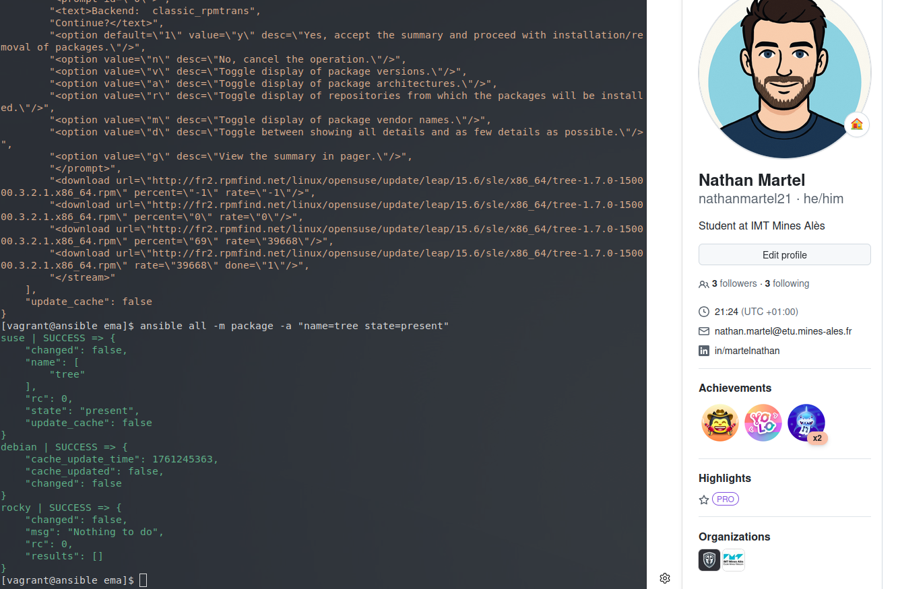
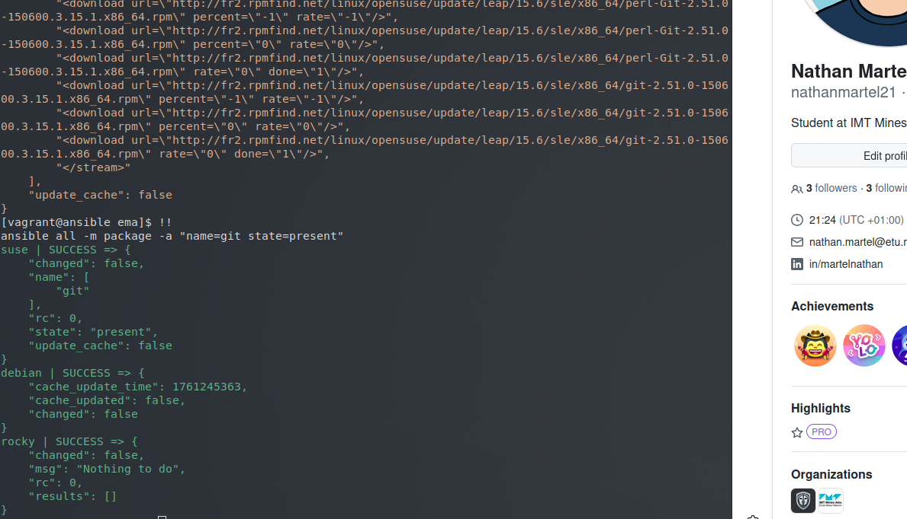
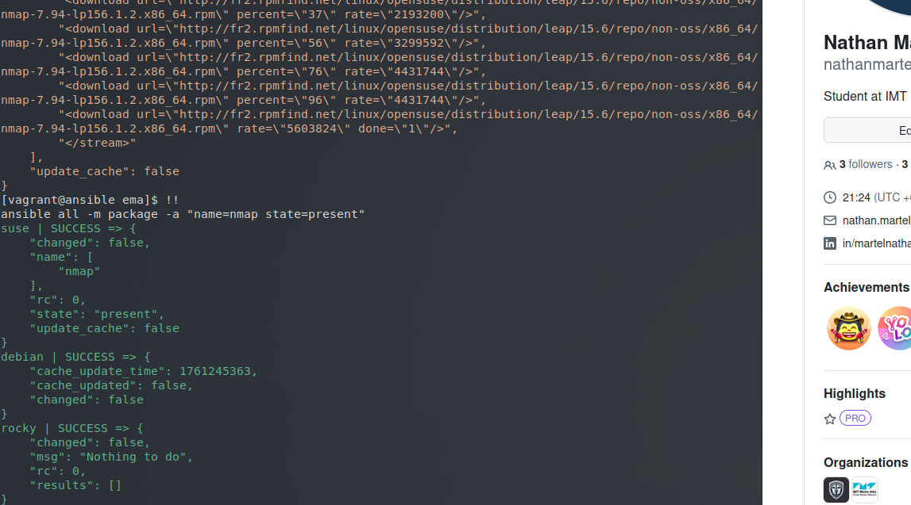
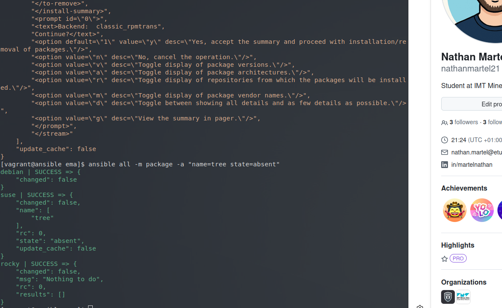
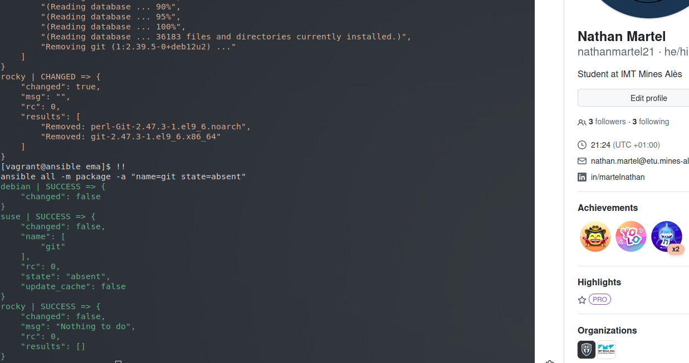
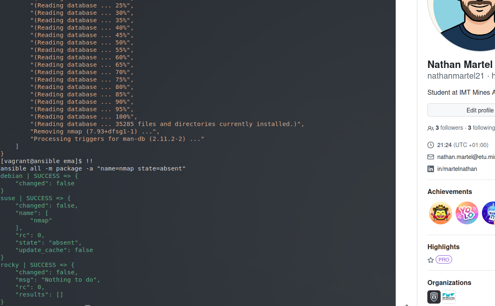
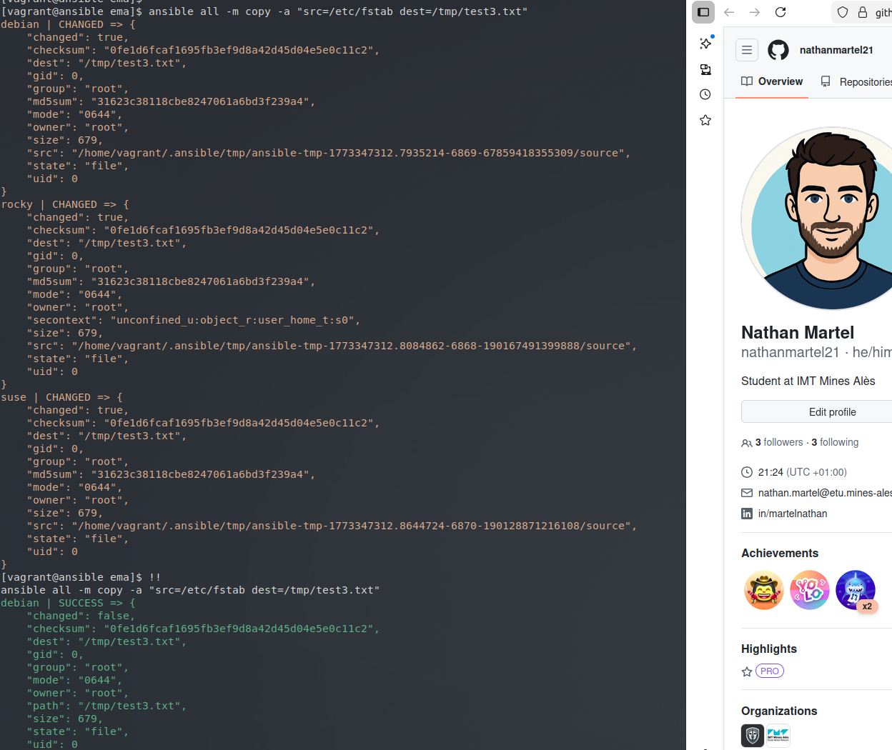
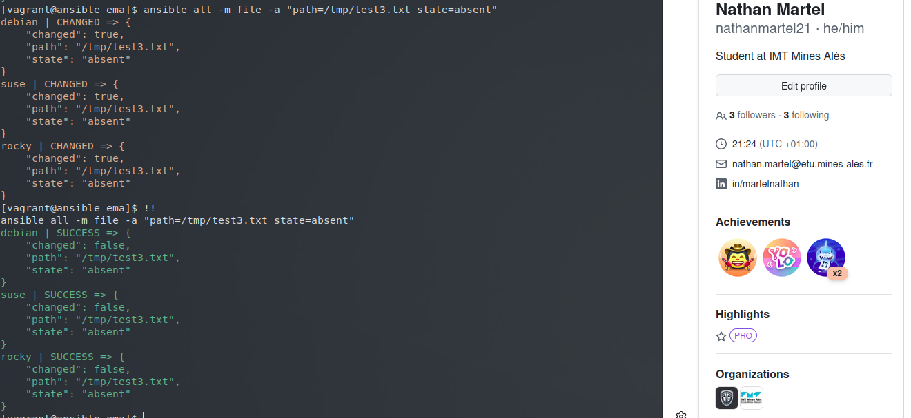
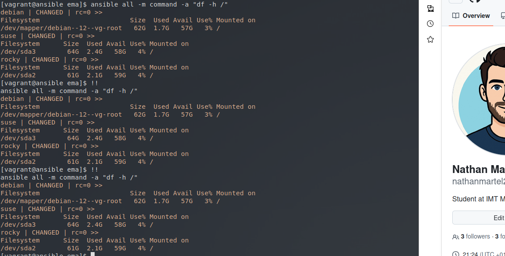

# Atelier-07 : L'idempotence avec Ansible

⚠️ **Ce document est classifié sous TLP: RED**

---

## Description

Cet atelier pratique a pour objectif d'**intégrer par la pratique le concept d'idempotence**, l'une des principales caractéristiques d'Ansible qui fait sa force par rapport aux méthodes de configuration traditionnelles comme les scripts shell.

L'idempotence est une propriété mathématique qui, appliquée aux systèmes de gestion de configuration, signifie qu'une exécution répétée des mêmes instructions produira toujours le même résultat. Une fois l'état désiré de la configuration atteint, les exécutions subséquentes auront pour seul effet de constater qu'il n'y a plus rien à faire.

## Démarrage des machines virtuelles

J'ai démarré l'ensemble des machines virtuelles du laboratoire depuis le répertoire `atelier-07` :

```bash
$ vagrant up
```

Quatre machines virtuelles sont initialisées :

| Machine virtuelle | Adresse IP     |
|-------------------|----------------|
| ansible           | 192.168.56.10  |
| rocky             | 192.168.56.20  |
| debian            | 192.168.56.30  |
| suse              | 192.168.56.40  |

## Connexion au Control Host

Je me suis connecté au Control Host (Ansible) avec la commande suivante :

```bash
$ vagrant ssh ansible
```

## Accès au répertoire du projet

Une fois connecté, j'ai navigué vers le répertoire du projet :

```bash
$ cd ansible/projets/ema/
$ ls
```

Le répertoire contient :
- `ansible.cfg` : fichier de configuration d'Ansible
- `inventory` : inventaire contenant les Target Hosts

## Vérification de la connectivité

Avant de commencer, j'ai vérifié que tous les Target Hosts sont accessibles :

```bash
$ ansible all -m ping
```

La réponse `pong` confirme que la connectivité SSH est établie sur l'ensemble des cibles.

---

## Installation de paquets (state=present)

### Installation du paquet `tree`

**Première exécution :**

```bash
$ ansible all -m package -a "name=tree state=present"
```

Résultat : Le module signale `changed: true`. Les paquets sont téléchargés et installés sur tous les Target Hosts.



**Deuxième exécution (idempotence) :**

```bash
$ ansible all -m package -a "name=tree state=present"
```

Résultat : Le module signale `changed: false`. Le paquet `tree` existe déjà sur toutes les cibles, donc aucune action n'est nécessaire. C'est l'idempotence en action.


### Installation du paquet `git`

**Première exécution :**

```bash
$ ansible all -m package -a "name=git state=present"
```

Résultat : Comme précédemment, `changed: true` et les paquets sont installés.



**Deuxième exécution (idempotence) :**

```bash
$ ansible all -m package -a "name=git state=present"
```

Résultat : `changed: false` puisque le paquet est déjà présent.


### Installation du paquet `nmap`

**Première exécution :**

```bash
$ ansible all -m package -a "name=nmap state=present"
```

Résultat : `changed: true` et installation du paquet sur tous les Target Hosts.



**Deuxième exécution (idempotence) :**

```bash
$ ansible all -m package -a "name=nmap state=present"
```

Résultat : `changed: false`, aucune action nécessaire.


---

## Désinstallation de paquets (state=absent)

### Désinstallation du paquet `tree`

**Première exécution :**

```bash
$ ansible all -m package -a "name=tree state=absent"
```

Résultat : `changed: true`. Le paquet est supprimé de tous les Target Hosts.



**Deuxième exécution (idempotence) :**

```bash
$ ansible all -m package -a "name=tree state=absent"
```

Résultat : `changed: false`. Le paquet n'existe plus, donc il n'y a rien à supprimer.


### Désinstallation du paquet `git`

**Première exécution :**

```bash
$ ansible all -m package -a "name=git state=absent"
```

Résultat : `changed: true`. Le paquet est supprimé.



**Deuxième exécution (idempotence) :**

```bash
$ ansible all -m package -a "name=git state=absent"
```

Résultat : `changed: false`.


### Désinstallation du paquet `nmap`

**Première exécution :**

```bash
$ ansible all -m package -a "name=nmap state=absent"
```

Résultat : `changed: true`. Suppression du paquet sur tous les Target Hosts.



**Deuxième exécution (idempotence) :**

```bash
$ ansible all -m package -a "name=nmap state=absent"
```

Résultat : `changed: false`.


---

## Gestion des fichiers

### Copie d'un fichier

J'ai copié le fichier `/etc/fstab` du Control Host vers tous les Target Hosts en le plaçant sous le chemin `/tmp/test3.txt` :

**Première exécution :**

```bash
$ ansible all -m copy -a "src=/etc/fstab dest=/tmp/test3.txt"
```

Résultat : `changed: true`. Le fichier est copié sur tous les Target Hosts.



**Deuxième exécution (idempotence) :**

```bash
$ ansible all -m copy -a "src=/etc/fstab dest=/tmp/test3.txt"
```

Résultat : `changed: false`. Le fichier existe sur la cible avec le même contenu. Le module `copy` détecte que la destination contient déjà le contenu du fichier source et ne refait rien.


### Suppression d'un fichier

J'ai supprimé le fichier `/tmp/test3.txt` en utilisant le module `file` avec le paramètre `state=absent` :

**Première exécution :**

```bash
$ ansible all -m file -a "path=/tmp/test3.txt state=absent"
```

Résultat : `changed: true`. Le fichier est supprimé de tous les Target Hosts.



**Deuxième exécution (idempotence) :**

```bash
$ ansible all -m file -a "path=/tmp/test3.txt state=absent"
```

Résultat : `changed: false`. Le fichier n'existe plus, donc il n'y a rien à supprimer.


---

## Cas où l'idempotence ne s'applique pas

Pour finir, j'ai exécuté la commande `df -h /` afin d'afficher l'espace utilisé par la partition principale :

**Première exécution :**

```bash
$ ansible all -a "df -h /"
```

**Deuxième exécution :**

```bash
$ ansible all -a "df -h /"
```

Observation : Contrairement aux modules idempotents vus précédemment, le module `command` (module par défaut lorsqu'on n'en spécifie pas) signale **toujours** `changed: true`, même si la commande est exécutée plusieurs fois avec les mêmes paramètres.



Cela s'explique par le fait que le module `command` n'est pas conçu pour être idempotent. Il exécute simplement une commande shell et retourne le résultat sans vérifier si un changement d'état a réellement eu lieu. C'est une distinction importante entre les modules Ansible (comme `package`, `copy`, `file`) qui sont idempotents, et les commandes shell génériques qui ne le sont pas.

---

## Conclusions sur l'idempotence

Ce laboratoire a démontré que :

1. **L'idempotence s'applique aux modules Ansible** : Les modules comme `package`, `copy` et `file` détectent l'état actuel et n'effectuent une action que si l'état désiré n'est pas atteint.

2. **Les changements sont signalés clairement** : La valeur `changed: true` indique qu'une action a été effectuée, tandis que `changed: false` indique que le système était déjà dans l'état désiré.

3. **Les commandes génériques ne sont pas idempotentes** : Le module `command` exécute toujours sa commande et signale `changed: true` à chaque fois.

4. **L'idempotence est la force d'Ansible** : Elle permet d'exécuter les mêmes playbooks plusieurs fois en confiance, sans crainte de surcharger ou de modifier le système de manière inattendue.

