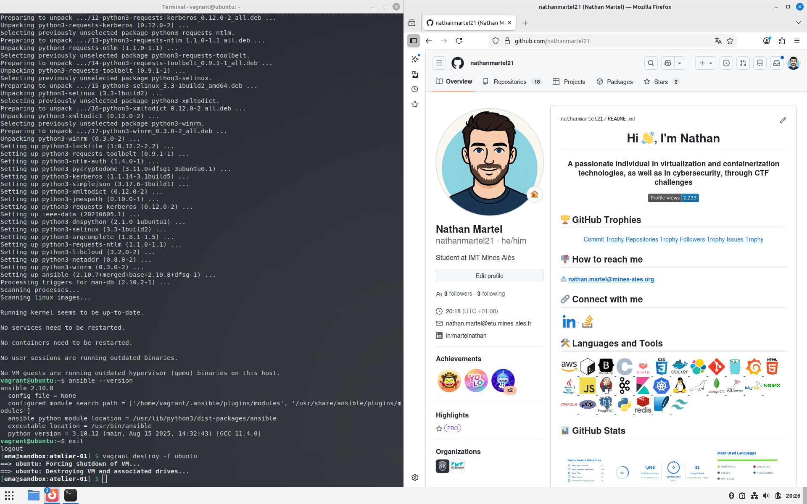

# Atelier-01 : Installation d’Ansible sur un Control Host (Ubuntu)

⚠️ **Ce document est classifié sous TLP: RED**

---

## Description

Cet atelier pratique a pour objectif d’installer **Ansible** sur une machine servant de **Control Host**.

Le Control Host est la machine depuis laquelle l’administrateur système exécute les commandes Ansible afin de gérer la configuration de plusieurs machines distantes appelées **Target Hosts**.

Dans ce laboratoire, une machine virtuelle **Ubuntu 22.04** est utilisée pour installer et tester Ansible via les dépôts officiels de la distribution.

## Démarrage de la machine virtuelle

Depuis le répertoire `atelier-01`, j’ai démarré la machine virtuelle Ubuntu avec la commande suivante :

```bash
$ vagrant up ubuntu
```

La machine virtuelle est correctement créée et démarrée via **VirtualBox**.

## Connexion à la machine virtuelle

Une fois la VM démarrée, je me suis connecté à la machine avec :

```bash
$ vagrant ssh ubuntu
```

## Mise à jour des dépôts

Avant toute installation de paquet, j’ai rafraîchi les informations des dépôts APT :

```bash
$ sudo apt update
```

Cette commande permet de récupérer les dernières informations concernant les paquets disponibles.

## Recherche du paquet Ansible

Ensuite, j’ai recherché le paquet **ansible** dans les dépôts officiels avec l’option `--names-only` :

```bash
$ apt-cache search --names-only ansible
```

Plusieurs paquets liés à Ansible sont disponibles :

- ansible
- ansible-core
- ansible-lint
- python3-ansible-runner
- etc.

Le paquet principal utilisé est **ansible**.

## Installation d’Ansible

J’ai ensuite installé Ansible à partir des dépôts officiels Ubuntu :

```bash
$ sudo apt install -y ansible
```

L’installation télécharge également plusieurs dépendances Python nécessaires au fonctionnement d’Ansible.

## Vérification de l’installation

Une fois l’installation terminée, j’ai vérifié la version d’Ansible installée :

```bash
$ ansible --version
```

Résultat :



La version installée via les dépôts Ubuntu est Ansible **2.10.8**.

## Suppression de la machine virtuelle

Une fois les tests terminés, j’ai quitté la machine virtuelle :

```bash
$ exit
```

Puis j’ai supprimé la VM avec la commande suivante :

```bash
$ vagrant destroy -f ubuntu
```

Cela permet de libérer les ressources et de supprimer complètement l’environnement de test.

## Auteur

> @uthor : Nathan Martel, étudiant en deuxième année à l'École des Mines d'Alès.

---

**TLP: RED** - Ce document markdown est classifié sous la marque TLP: RED
