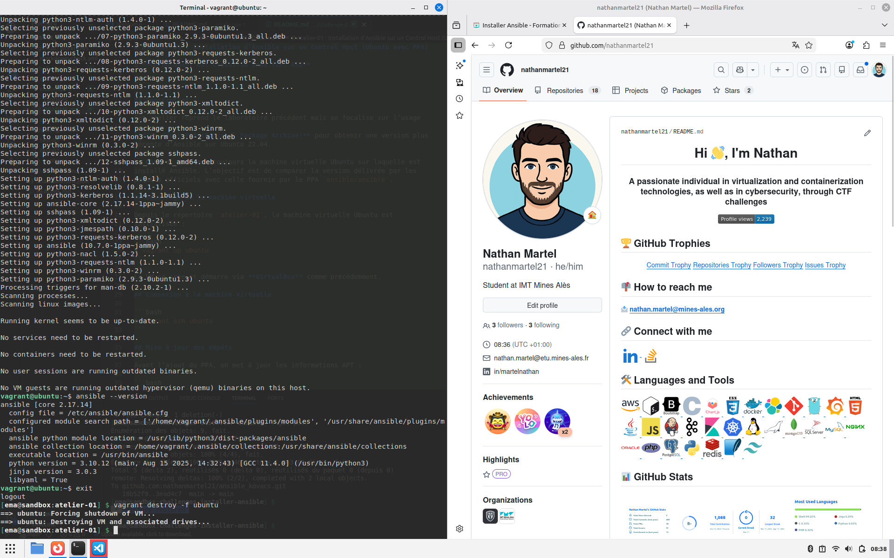

# Atelier-01 : Installation d’Ansible sur un Control Host (Ubuntu avec PPA)

⚠️ **Ce document est classifié sous TLP: RED**

---

## Description

Cet atelier reprend le laboratoire précédent mais se focalise sur l’usage **d’un dépôt PPA (Personal Package Archive)** pour obtenir une version plus récente d’Ansible sur Ubuntu 22.04.

Le Control Host est toujours la machine virtuelle Ubuntu sur laquelle est installé Ansible. L’objectif est de comparer la version délivrée par les paquets officiels avec celle fournie par le PPA `ansible/ansible`.

## Démarrage de la machine virtuelle

Depuis le répertoire `atelier-01`, la machine virtuelle Ubuntu est initialisée :

```bash
$ vagrant up ubuntu
```

La VM se crée et démarre via **VirtualBox** comme précédemment.

## Connexion à la machine virtuelle

```bash
$ vagrant ssh ubuntu
```

## Mise à jour des dépôts

Avant l’ajout du PPA, on met à jour les informations APT :

```bash
$ sudo apt update
```

## Ajout du dépôt PPA pour Ansible

Le passage au PPA se fait avec la commande suivante :

```bash
$ sudo apt-add-repository ppa:ansible/ansible
```

Le dépôt est ajouté et les clés sont importées automatiquement. Un `apt update` est exécuté ensuite pour rafraîchir l’index :

```bash
$ sudo apt update
```

## Recherche et installation du paquet Ansible

On peut inspecter à nouveau les paquets disponibles :

```bash
$ apt-cache search --names-only ansible
```

Le paquet `ansible` reste celui à installer ; sa source est désormais le PPA. La commande d’installation est identique :

```bash
$ sudo apt install -y ansible
```

APT télécharge la version la plus récente fournie par le PPA et ses dépendances.

## Vérification de l’installation

Après installation, on vérifie la version d’Ansible :

```bash
$ ansible --version
```

Dans mon cas, la version est visible sur la capture ci-dessous :



Cette version issue du PPA (**2.17.14**) est plus récente que celle obtenue via les dépôts officiels du challenge 1 (2.10.8). Le PPA permet donc de disposer rapidement des dernières améliorations.

## Suppression de la machine virtuelle

Une fois les vérifications terminées, on quitte la VM :

```bash
$ exit
```

Puis on la détruit :

```bash
$ vagrant destroy -f ubuntu
```

## Auteur

> @uthor : Nathan Martel, étudiant en deuxième année à l'École des Mines
d'Alès.

---

**TLP: RED** - Ce document markdown est classifié sous la marque TLP: RED
