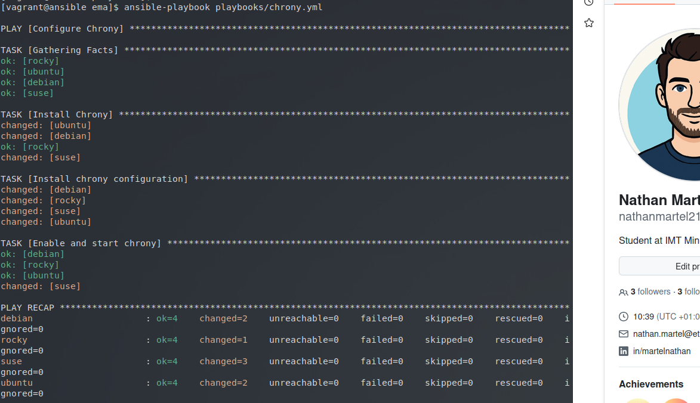
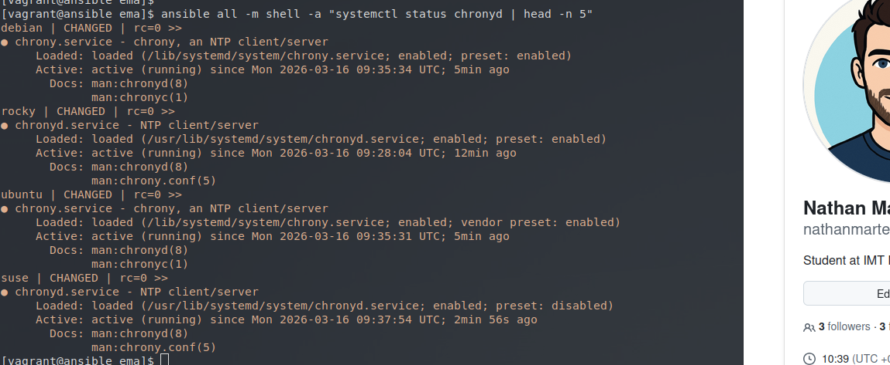

# Atelier-18 : Jinja & Templates

⚠️ **Ce document est classifié sous TLP: RED**

---

## Description

Cet atelier pratique a pour objectif de découvrir et de manipuler les **templates Jinja2** dans Ansible. Les templates permettent de personnaliser dynamiquement les fichiers que nous installons sur les Target Hosts.

Dans le cadre de ce laboratoire, l'objectif final était de déployer le service de synchronisation NTP `chrony` sur un parc hétérogène (Debian, Ubuntu, Rocky Linux, SUSE Linux). L'enjeu principal était d'utiliser le module `template` pour injecter dynamiquement le chemin absolu du fichier de configuration en tant que commentaire sur la première ligne, en adaptant ce chemin selon la famille du système d'exploitation cible.

## Démarrage des machines virtuelles

Depuis le répertoire de l'atelier, j'ai démarré les machines virtuelles avec la commande suivante :

```bash
$ vagrant up
```

Cinq machines virtuelles sont initialisées pour ce laboratoire :

| Machine virtuelle | Adresse IP     | Distribution  |
|-------------------|----------------|---------------|
| ansible           | 192.168.56.10  | Control Host  |
| rocky             | 192.168.56.20  | Rocky Linux   |
| debian            | 192.168.56.30  | Debian        |
| suse              | 192.168.56.40  | SUSE Linux    |
| ubuntu            | 192.168.56.50  | Ubuntu        |

## Connexion au Control Host et accès au projet

Je me suis connecté au Control Host avec la commande suivante :

```bash
$ vagrant ssh ansible
```

Une fois connecté, j'ai navigué vers le répertoire des playbooks du projet Ansible :

```bash
$ cd ~/ansible/projets/ema/
```

L'environnement `direnv` s'est chargé automatiquement.

---

## Création du Template Jinja2

Le module `template` va par défaut chercher les fichiers portant l'extension `.j2` dans un sous-répertoire `templates/` situé à côté du playbook.

J'ai donc créé ce répertoire et le fichier template `chrony.conf.j2` :

```bash
$ mkdir -p playbooks/templates
$ vim playbooks/templates/chrony.conf.j2
```

J'ai inséré la configuration NTP demandée, en utilisant la syntaxe Jinja2 `{{ chrony_conf_path }}` sur la première ligne pour que la variable (définie dans le playbook) s'injecte dynamiquement :

```jinja2
# {{ chrony_conf_path }}

server 0.fr.pool.ntp.org iburst
server 1.fr.pool.ntp.org iburst
server 2.fr.pool.ntp.org iburst
server 3.fr.pool.ntp.org iburst

driftfile /var/lib/chrony/drift
makestep 1.0 3
rtcsync
logdir /var/log/chrony
```

---

## Création du playbook

Ensuite, j'ai écrit le playbook `chrony.yml`. J'ai utilisé une définition de variables conditionnelles (`if/else` en syntaxe Jinja2) dans la section `vars` pour attribuer le bon chemin de configuration et le bon nom de service selon la famille d'OS (`ansible_os_family`).

```bash
$ vim playbooks/chrony.yml
```

Voici le contenu du playbook :

```yaml
---
- name: Configure Chrony
  hosts: all
  become: true

  vars:
    chrony_conf_path: >-
      {{ '/etc/chrony/chrony.conf'
         if ansible_os_family == 'Debian'
         else '/etc/chrony.conf' }}

    chrony_service: >-
      {{ 'chrony'
         if ansible_os_family == 'Debian'
         else 'chronyd' }}

  tasks:

    - name: Install Chrony
      package:
        name: chrony
        state: present

    - name: Install chrony configuration
      template:
        src: chrony.conf.j2
        dest: "{{ chrony_conf_path }}"
        mode: 0644

    - name: Enable and start chrony
      service:
        name: "{{ chrony_service }}"
        state: started
        enabled: true
```

---

## Exécution et validation

Avant de lancer le déploiement, j'ai vérifié la syntaxe YAML de mon playbook à l'aide de `yamllint` :

```bash
$ yamllint playbooks/chrony.yml
```

Aucune erreur n'a été retournée. J'ai alors exécuté le playbook sur l'ensemble du parc :

```bash
$ cd ..
$ ansible-playbook playbooks/chrony.yml
```

Le résultat confirme le bon déploiement de la configuration sur toutes les distributions hétérogènes (Debian, Ubuntu, Rocky Linux et SUSE) :

]

Pour vérifier la bonne prise en compte, j'ai vérifié le statut du service avec le module `shell` :

```bash
$ ansible all -m shell -a "systemctl status chronyd | head -n 5"
```



---

## Arrêt des machines virtuelles

Une fois l'atelier terminé, j’ai quitté le Control Host et supprimé toutes les VM pour nettoyer l'environnement :

```bash
$ exit
$ vagrant destroy -f
```

## Auteur

> @uthor : Nathan Martel, étudiant en deuxième année à l'École des Mines d'Alès.

---

**TLP: RED** - Ce document markdown est classifié sous la marque TLP: RED
