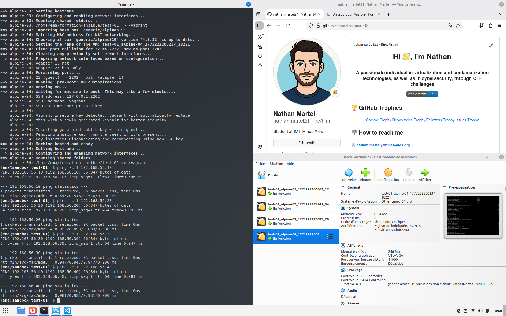
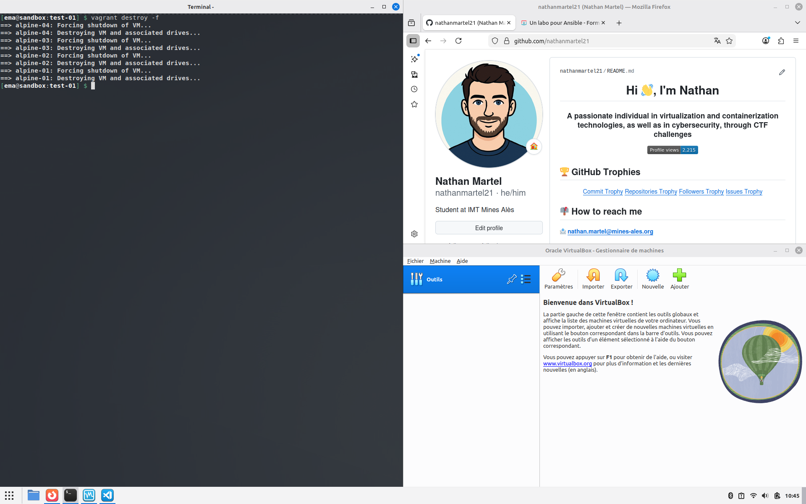

# Test-01 : Prise en main et premier test avec Ansible

⚠️ **Ce document est classifié sous TLP: RED**

---

## Description

Ce test-01 fait partie du laboratoire Ansible sur la prise en main et le premier test. Il utilise quatre machines Alpine Linux 3.19 pour mettre en place un labo avec des machines pour utiliser ensuite Ansible.

## Récupération de la box Vagrant

J'ai récupéré la box Alpine Linux 3.19 compatible avec VirtualBox :

```bash
$ vagrant box add generic/alpine319
```

## Démarrage des machines virtuelles

J'ai démarré le cluster de quatre machines virtuelles Alpine Linux avec la commande `vagrant up`. Les machines virtuelles sont bien créées dans VirtualBox.



## Vérification de la connectivité réseau

J'ai vérifié que chacun des hôtes était accessible en envoyant des pings :

```bash
$ ping -c 1 192.168.56.10
$ ping -c 1 192.168.56.20
$ ping -c 1 192.168.56.30
$ ping -c 1 192.168.56.40
```

## Destruction des machines virtuelles

Ensuite, j'ai détruit les machines virtuelles de manière forcée avec la commande `vagrant destroy -f`.



## Auteur

> @uthor : Nathan Martel, étudiant en deuxième année à l'École des Mines d'Alès.

---

**TLP: RED** - Ce document markdown est classifié sous la marque TLP: RED
