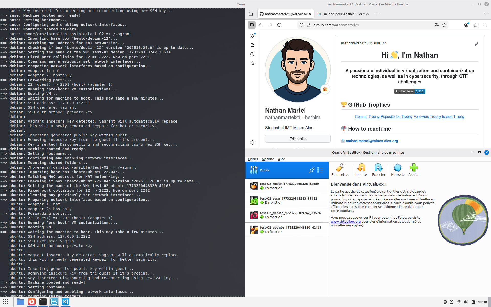
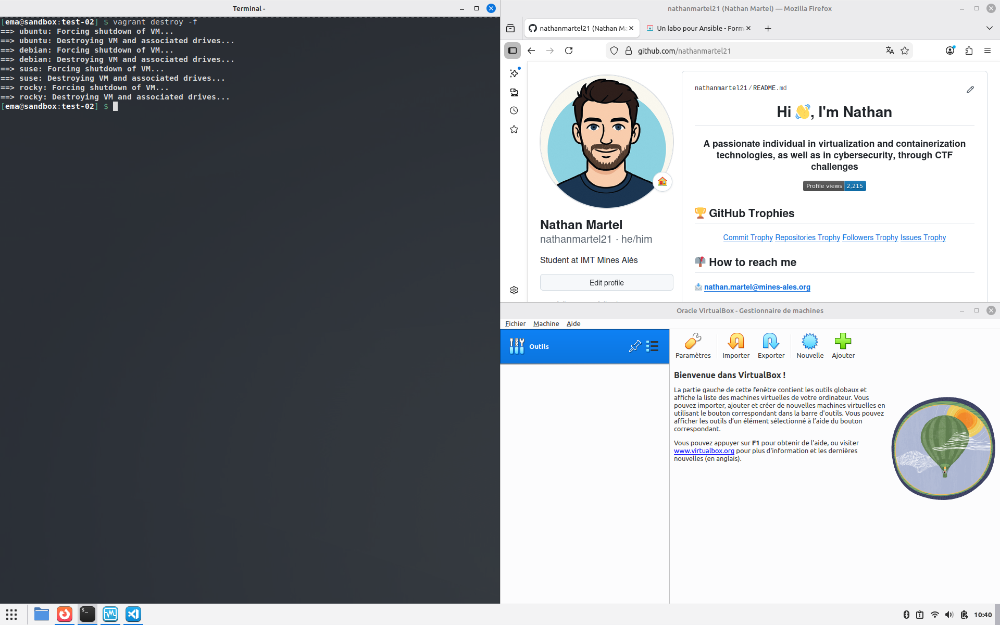

# Test-02 : Une box pour chaque distribution

⚠️ **Ce document est classifié sous TLP: RED**

---

## Description

Ce test-02 fait partie du laboratoire Ansible. Il utilise quatre boxes Vagrant représentant les principales distributions Linux rencontrées en contexte professionnel :

- **Rocky Linux 9** (clone de Red Hat Enterprise Linux)
- **Debian 12**
- **OpenSUSE Leap 15** (mouture libre de SUSE Linux Enterprise Server)
- **Ubuntu 22.04** (dérivée de Debian avec support LTS)

## Récupération des boxes Vagrant

J'ai récupéré les quatre boxes Vagrant en utilisant les commandes suivantes :

```bash
$ vagrant box add bento/rockylinux-9
$ vagrant box add bento/debian-12
$ vagrant box add bento/opensuse-leap-15
$ vagrant box add bento/ubuntu-22.04
```

## Démarrage du cluster de machines virtuelles

J'ai démarré le cluster complet avec la commande `vagrant up`. Les quatre machines virtuelles sont bien créées dans VirtualBox.



## Destruction du cluster de machines virtuelles

Ensuite, j'ai détruit toutes les machines virtuelles de manière forcée avec la commande `vagrant destroy -f`.



## Auteur

> @uthor : Nathan Martel, étudiant en deuxième année à l'École des Mines d'Alès.

---

**TLP: RED** - Ce document markdown est classifié sous la marque TLP: RED
