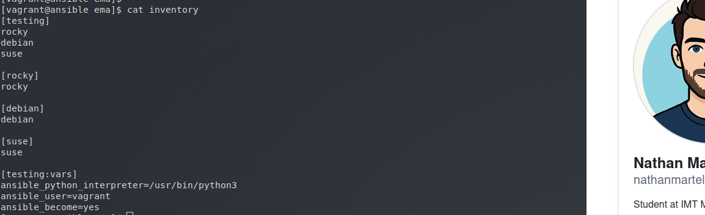
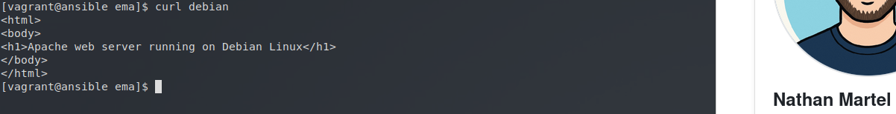
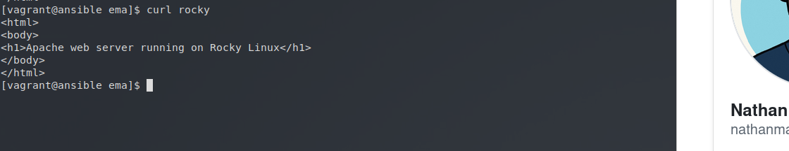
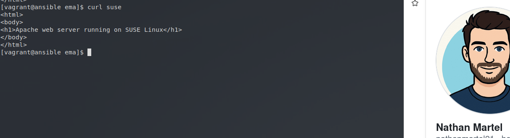

# Atelier-10 : Un serveur web simple avec Apache

⚠️ **Ce document est classifié sous TLP: RED**

---

## Description

Cet atelier pratique a pour objectif de déployer un serveur web simple avec Apache sur différentes distributions Linux (Debian, Rocky Linux et SUSE Linux). L'enjeu est d'utiliser des playbooks Ansible pour gérer les spécificités de chaque distribution Linux, notamment en ce qui concerne le gestionnaire de paquets, le nom du service Apache et l'emplacement par défaut de la page web (`DocumentRoot`).

## Démarrage des machines virtuelles

Depuis le répertoire `atelier-10`, j'ai démarré les machines virtuelles avec la commande suivante :

```bash
$ vagrant up
```

Quatre machines virtuelles sont initialisées pour ce laboratoire :

| Machine virtuelle | Adresse IP     | Distribution  |
|-------------------|----------------|---------------|
| ansible           | 192.168.56.10  | Control Host  |
| rocky             | 192.168.56.20  | Rocky Linux   |
| debian            | 192.168.56.30  | Debian        |
| suse              | 192.168.56.40  | SUSE Linux    |

## Connexion au Control Host et accès au projet

Je me suis connecté au Control Host avec la commande suivante :

```bash
$ vagrant ssh ansible
```

Une fois connecté, j'ai navigué vers le répertoire du projet Ansible :

```bash
$ cd ansible/projets/ema/
```

L'environnement `direnv` s'est chargé automatiquement.

## Modification de l'inventaire et vérification

Afin de commencer à écrire les playbooks, j'ai édité le fichier `inventory` pour y ajouter les groupes d'hôtes `[rocky]`, `[debian]` et `[suse]` pour les différentes distributions.



J'ai ensuite vérifié la connectivité avec un ping Ansible, cela fonctionnait bien.

```bash
$ ansible all -m ping
```

---

## Déploiement sur Debian

J'ai créé le playbook `playbooks/apache-debian.yml`. Pour Debian, le gestionnaire de paquets est `apt`, le service s'appelle `apache2` et le répertoire racine du serveur web est `/var/www/html/` :

```yaml
---
- hosts: debian

  tasks:
    - name: Update apt cache
      apt:
        update_cache: true

    - name: Install Apache
      apt:
        name: apache2
        state: present

    - name: Start and enable Apache
      service:
        name: apache2
        state: started
        enabled: true

    - name: Install custom web page
      copy:
        dest: /var/www/html/index.html
        mode: 0644
        content: |
          <html>
          <body>
          <h1>Apache web server running on Debian Linux</h1>
          </body>
          </html>
```

J'ai exécuté le playbook, puis j'ai vérifié la page web avec `curl` depuis le Control Host :

```bash
$ ansible-playbook playbooks/apache-debian.yml
$ curl debian
```
Résultat obtenu : 



Le résultat montre que la page renvoie bien `Apache web server running on Debian Linux`.

---

## Déploiement sur Rocky Linux

J'ai créé le playbook `playbooks/apache-rocky.yml`. Sous Rocky Linux, le gestionnaire de paquets est `dnf` et le paquet/service Apache porte le nom de `httpd` :

```yaml
---
- hosts: rocky

  tasks:
    - name: Install Apache
      dnf:
        name: httpd
        state: present

    - name: Start and enable Apache
      service:
        name: httpd
        state: started
        enabled: true

    - name: Install custom web page
      copy:
        dest: /var/www/html/index.html
        mode: 0644
        content: |
          <html>
          <body>
          <h1>Apache web server running on Rocky Linux</h1>
          </body>
          </html>
```

J'ai exécuté le playbook, puis j'ai vérifié la page web avec `curl` depuis le Control Host :

```bash
$ ansible-playbook playbooks/apache-rocky.yml
$ curl rocky
```
Résultat obtenu : 



Le résultat montre que la page renvoie bien `Apache web server running on Rocky Linux`.

---

## Déploiement sur SUSE Linux

J'ai créé le playbook `playbooks/apache-suse.yml`. Sur SUSE Linux, le gestionnaire de paquets est `zypper`, le service est `apache2`, mais attention, le répertoire web par défaut est `/srv/www/htdocs/` :

```yaml
---
- hosts: suse

  tasks:
    - name: Install Apache
      zypper:
        name: apache2
        state: present

    - name: Start and enable Apache
      service:
        name: apache2
        state: started
        enabled: true

    - name: Install custom web page
      copy:
        dest: /srv/www/htdocs/index.html
        mode: 0644
        content: |
          <html>
          <body>
          <h1>Apache web server running on SUSE Linux</h1>
          </body>
          </html>
```

J'ai exécuté le playbook, puis j'ai vérifié la page web avec `curl` depuis le Control Host :

```bash
$ ansible-playbook playbooks/apache-suse.yml
$ curl suse
```
Résultat obtenu : 



Le résultat montre que la page renvoie bien `Apache web server running on SUSE Linux`.

---

## Arrêt des machines virtuelles

Une fois les tests terminés, j’ai quitté le Control Host et supprimé toutes les VM pour nettoyer l'environnement :

```bash
$ exit
$ vagrant destroy -f
```

## Auteur

> @uthor : Nathan Martel, étudiant en deuxième année à l'École des Mines d'Alès.

---

**TLP: RED** - Ce document markdown est classifié sous la marque TLP: RED
