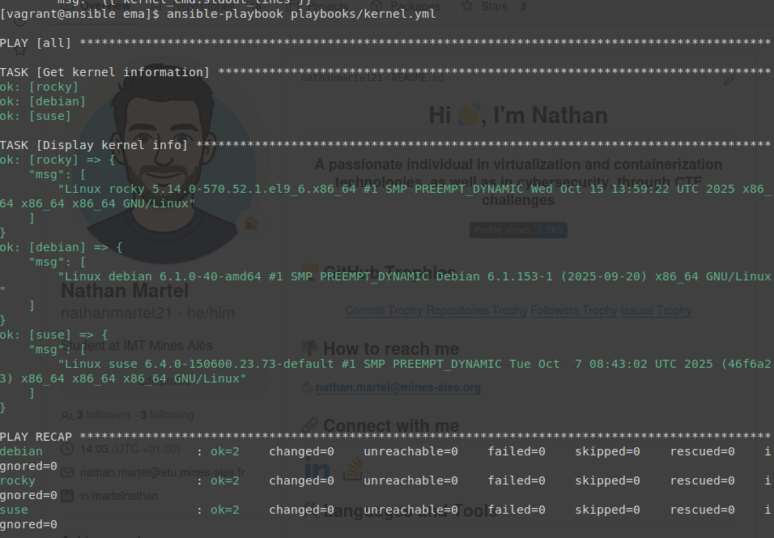
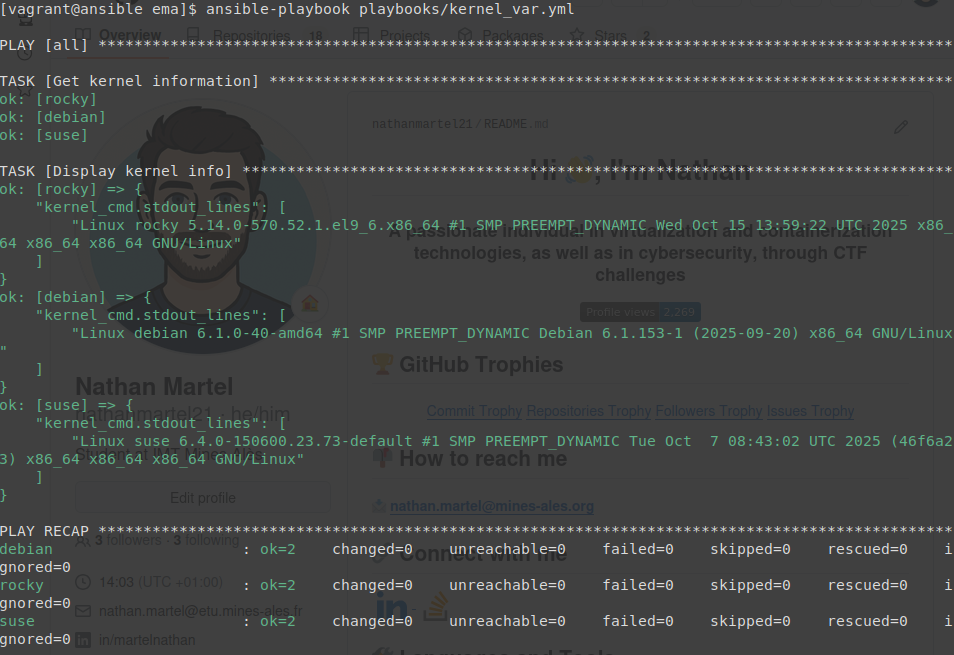
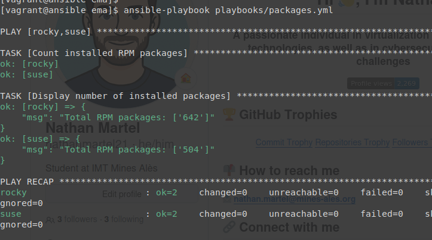

# Atelier-15 : Les variables enregistrées

⚠️ **Ce document est classifié sous TLP: RED**

---

## Description

Cet atelier pratique a pour objectif d'intégrer par la pratique le fonctionnement des **variables enregistrées** dans Ansible. J'ai pu expérimenter l'utilisation de la directive `register` avec les modules `command` et `shell` pour capturer la sortie standard de commandes Linux spécifiques (`uname` et `rpm`) et les réutiliser ou les afficher via le module `debug`.

## Démarrage des machines virtuelles

Depuis le répertoire de l'atelier `atelier-15`, j'ai démarré les machines virtuelles avec la commande suivante :

```bash
$ vagrant up
```

Quatre machines virtuelles sont initialisées pour ce laboratoire :

| Machine virtuelle | Adresse IP     | Distribution  |
|-------------------|----------------|---------------|
| ansible           | 192.168.56.10  | Control Host  |
| rocky             | 192.168.56.20  | Rocky Linux   |
| debian            | 192.168.56.30  | Debian        |
| suse              | 192.168.56.40  | SUSE Linux    |

## Connexion au Control Host et accès au projet

Je me suis connecté au Control Host avec la commande suivante :

```bash
$ vagrant ssh ansible
```

Une fois connecté, j'ai navigué vers le répertoire des playbooks du projet Ansible :

```bash
$ cd ansible/projets/ema/playbooks/
```

L'environnement `direnv` s'est chargé automatiquement.

---

## Récupération des informations du noyau avec le paramètre `msg`

J'ai créé un playbook `playbooks/kernel.yml` qui exécute la commande `uname -a` sur tous les hôtes cibles. Le paramètre `changed_when: false` indique à Ansible que cette commande de lecture ne modifie pas le système. Le résultat est stocké dans la variable `kernel_cmd` via la directive `register`.

Voici le contenu du fichier `playbooks/kernel.yml` :

```yaml
---
- hosts: all
  gather_facts: false

  tasks:

    - name: Get kernel information
      command: uname -a
      changed_when: false
      register: kernel_cmd

    - name: Display kernel info
      debug:
        msg: "{{ kernel_cmd.stdout_lines }}"
```

J'ai exécuté ce playbook :

```bash
$ ansible-playbook playbooks/kernel.yml
```

Résultat : Le playbook s'est exécuté sans erreur :



---

## Récupération des informations du noyau avec le paramètre `var`

J'ai ensuite créé une variante de ce playbook, nommée `playbooks/kernel_var.yml`, pour tester l'utilisation du paramètre `var` du module `debug` à la place de `msg`.

```yaml
---
- hosts: all
  gather_facts: false

  tasks:

    - name: Get kernel information
      command: uname -a
      changed_when: false
      register: kernel_cmd

    - name: Display kernel info
      debug:
        var: kernel_cmd.stdout_lines
```

J'ai exécuté ce playbook de la même manière :

```bash
$ ansible-playbook playbooks/kernel_var.yml
```

Résultat : L'affichage est très similaire, la différence réside dans le fait que la clé affichée dans le retour du module `debug` porte directement le nom de la variable évaluée (`kernel_cmd.stdout_lines`) plutôt que le libellé générique `msg`.



---

## Comptage des paquets RPM installés (utilisation du module shell)

Pour le dernier exercice, j'ai écrit un playbook `playbooks/packages.yml` ciblant uniquement les hôtes qui utilisent le format de paquets RPM (à savoir `rocky` et `suse`). Étant donné que la commande utilise le symbole de redirection ("pipe" `|`), il est indispensable d'utiliser le module `shell` et non le module `command`.

```yaml
---
- hosts: rocky,suse
  gather_facts: false

  tasks:

    - name: Count installed RPM packages
      shell: rpm -qa | wc -l
      changed_when: false
      register: rpm_count

    - name: Display number of installed packages
      debug:
        msg: "Total RPM packages: {{ rpm_count.stdout_lines }}"
```

J'ai exécuté ce playbook :

```bash
$ ansible-playbook playbooks/packages.yml
```

Résultat obtenu :



L'affichage nous indique que 642 paquets RPM sont installés sur le Target Host Rocky Linux, contre 504 sur la machine SUSE Linux.

---

## Arrêt des machines virtuelles

Une fois l'atelier terminé, j’ai quitté le Control Host et supprimé toutes les VM pour nettoyer l'environnement de travail :

```bash
$ exit
$ vagrant destroy -f
```

## Auteur

> @uthor : Nathan Martel, étudiant en deuxième année à l'École des Mines d'Alès.

---

**TLP: RED** - Ce document markdown est classifié sous la marque TLP: RED
