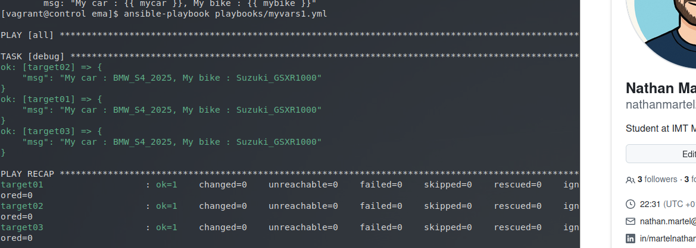
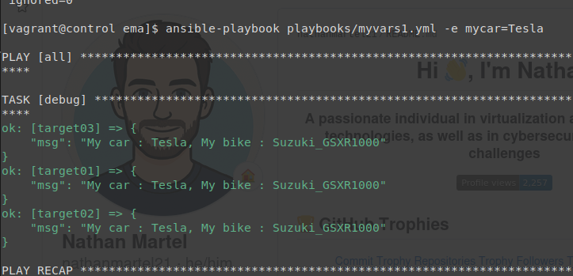
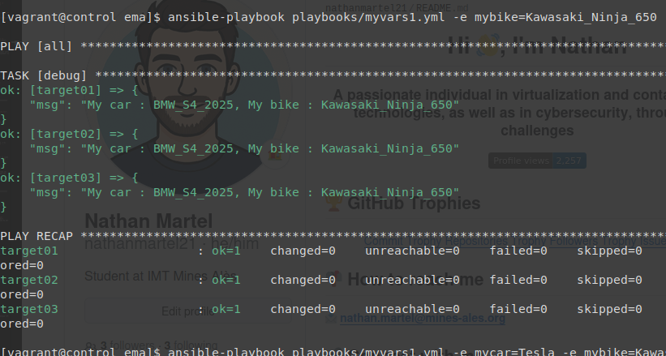
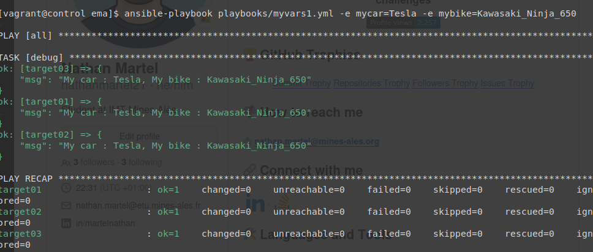
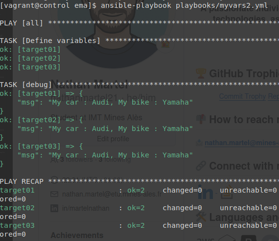
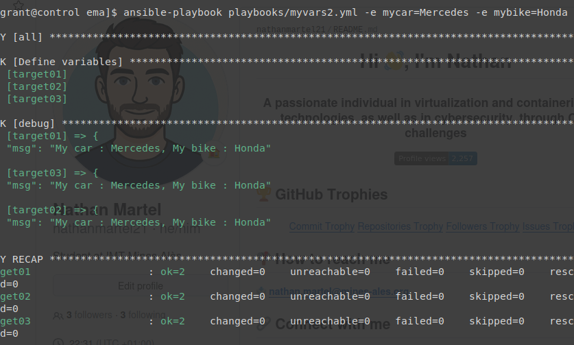
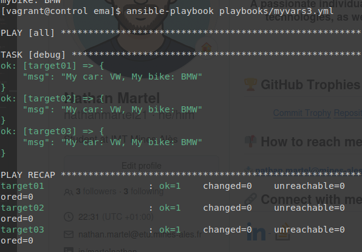
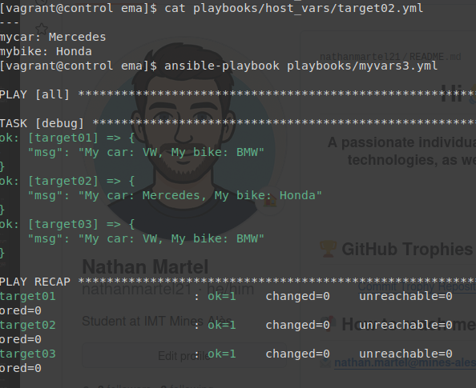
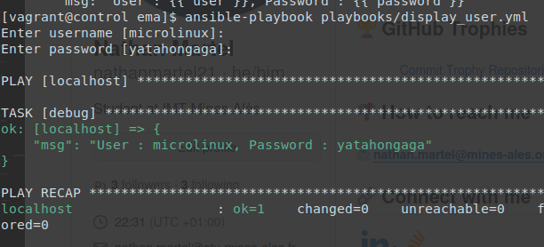
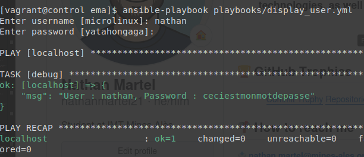

# Atelier-14 : Les variables Ansible

⚠️ **Ce document est classifié sous TLP: RED**

---

## Description

Cet atelier pratique a pour objectif d'intégrer par la pratique le fonctionnement des **variables** dans Ansible. J'ai pu expérimenter différentes méthodes pour définir des variables (`play vars`, `set_fact`, `group_vars`, `host_vars` et `vars_prompt`) ainsi que leurs règles de précédence.

## Démarrage des machines virtuelles

Depuis le répertoire `atelier-14`, j'ai démarré les machines virtuelles avec la commande suivante :

```bash
$ vagrant up
```

Quatre machines virtuelles sont initialisées pour ce laboratoire :

| Machine virtuelle | Adresse IP     | Distribution  |
|-------------------|----------------|---------------|
| control           | 192.168.56.10  | Control Host  |
| target01          | 192.168.56.20  | Rocky Linux   |
| target02          | 192.168.56.30  | Rocky Linux   |
| target03          | 192.168.56.40  | Rocky Linux   |

## Connexion au Control Host et accès au projet

Je me suis connecté au Control Host avec la commande suivante :

```bash
$ vagrant ssh control
```

Une fois connecté, j'ai navigué vers le répertoire du projet Ansible :

```bash
$ cd ansible/projets/ema/
```

L'environnement `direnv` s'est chargé automatiquement. L'inventaire définit les trois Target Hosts.

---

## Les "play vars" et "extra vars"

Pour commencer, j'ai écrit un playbook `playbooks/myvars1.yml` qui définit deux variables (`mycar` et `mybike`) directement dans la section `vars` du play :

```yaml
---
- hosts: all
  gather_facts: false

  vars:
    mycar: BMW_S4_2025
    mybike: Suzuki_GSXR1000

  tasks:
    - debug:
        msg: "My car : {{ mycar }}, My bike : {{ mybike }}"
```

J'ai exécuté ce playbook de manière standard :

```bash
$ ansible-playbook playbooks/myvars1.yml
```

Résultat :



Ensuite, j'ai surchargé successivement ces variables depuis la ligne de commande en utilisant l'option `-e` (extra vars), qui possède la précédence la plus élevée :

**Remplacement d'une seule variable (`mycar`) :**

```bash
$ ansible-playbook playbooks/myvars1.yml -e mycar=Tesla
```



**Remplacement de l'autre variable (`mybike`) :**

```bash
$ ansible-playbook playbooks/myvars1.yml -e mybike=Kawasaki_Ninja_650
```



**Remplacement des deux variables à la fois :**

```bash
$ ansible-playbook playbooks/myvars1.yml -e mycar=Tesla -e mybike=Kawasaki_Ninja_650
```

Résultat :



---

## Les variables dynamiques avec `set_fact`

J'ai écrit un second playbook `playbooks/myvars2.yml` utilisant cette fois le module `set_fact` pour définir les variables dynamiquement au sein d'une tâche :

```yaml
---
- hosts: all
  gather_facts: false

  tasks:
    - name: Define variables
      set_fact:
        mycar: Audi
        mybike: Yamaha

    - debug:
        msg: "My car : {{ mycar }}, My bike : {{ mybike }}"
```

Sans surcharger les variables, j'ai exécuté ce playbook :

```bash
$ ansible-playbook playbooks/myvars2.yml
```

Résultat :



Ensuite, j'ai testé la surcharge avec les extra vars :

```bash
$ ansible-playbook playbooks/myvars2.yml -e mycar=Mercedes -e mybike=Honda
```

Résultat :



Les `extra vars` l'emportent également sur les variables `set_fact`.

---

## Définition de variables avec `group_vars` et `host_vars`

J'ai créé un troisième playbook `playbooks/myvars3.yml` qui fait simplement appel aux variables sans les définir dans le fichier :

```yaml
---
- hosts: all
  gather_facts: false

  tasks:
    - debug:
        msg: "My car: {{ mycar }}, My bike: {{ mybike }}"
```

Afin d'appliquer des valeurs par défaut pour tous les hôtes, j'ai créé le répertoire et fichier `playbooks/group_vars/all.yml` :

```bash
mkdir playbooks/group_vars
vim playbooks/group_vars/all.yml
```

```yaml
---
mycar: VW
mybike: BMW
```

Pour la première exécution, voici le résultat :

```bash
$ ansible-playbook playbooks/myvars3.yml
```

Résultat :



Puis, j'ai spécifié des valeurs différentes uniquement pour la cible `target02` en créant le fichier `playbooks/host_vars/target02.yml` :

```bash
mkdir playbooks/host_vars
vim playbooks/host_vars/target02.yml
```

```yaml
---
mycar: Mercedes
mybike: Honda
```

Lors de cette seconde exécution, on observe très bien que `target02` prend les valeurs de ses `host_vars` (qui sont prioritaires) tandis que les autres cibles conservent les valeurs de `group_vars/all` :

```bash
$ ansible-playbook playbooks/myvars3.yml
```

Résultat :



---

## Les variables interactives avec `vars_prompt`

Pour finir, j'ai créé un playbook `playbooks/display_user.yml` utilisant le mécanisme `vars_prompt` pour demander des valeurs à l'utilisateur lors de l'exécution, tout en masquant la saisie du mot de passe :

```yaml
---
- hosts: localhost
  gather_facts: false

  vars_prompt:
    - name: user
      prompt: Enter username
      default: microlinux
      private: false

    - name: password
      prompt: Enter password
      default: yatahongaga
      private: true

  tasks:
    - debug:
        msg: "User : {{ user }}, Password : {{ password }}"
```

J'ai commencé par tester ce playbook avec les valeurs par défaut, donc en laissant vide :

```bash
$ ansible-playbook playbooks/display_user.yml
Enter username [microlinux]:
Enter password [yatahongaga]: 
```

Résultat :



On retrouve donc les valeurs par défaut, à savoir `microlinux` et `yatahongaga`.

Ensuite, j'ai testé ce playbook en entrant mes propres valeurs :

```bash
$ ansible-playbook playbooks/display_user.yml
Enter username [microlinux]: nathan
Enter password [yatahongaga]: 
```

Résultat :



Le mot de passe n'est pas visible sur la capture d'écran car il n'est pas visible dans le terminal. On voit en revanche dans la sortie ansible que le mot de passe est `ceciestmonmotdepasse`.

---

## Arrêt des machines virtuelles

Une fois l'atelier terminé, j’ai quitté le Control Host et supprimé toutes les VM pour nettoyer l'environnement :

```bash
$ exit
$ vagrant destroy -f
```

## Auteur

> @uthor : Nathan Martel, étudiant en deuxième année à l'École des Mines d'Alès.

---

**TLP: RED** - Ce document markdown est classifié sous la marque TLP: RED
