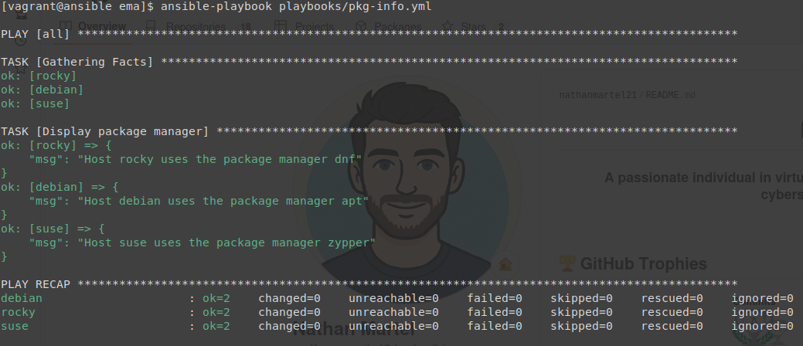
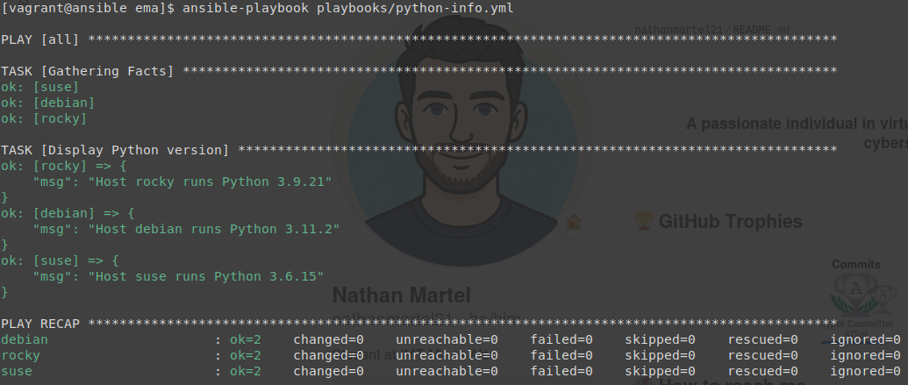
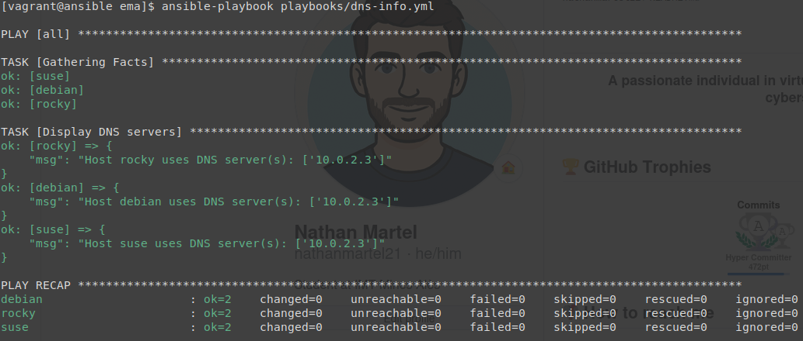

# Atelier-16 : Facts et variables implicites

⚠️ **Ce document est classifié sous TLP: RED**

---

## Description

Cet atelier pratique a pour objectif d'intégrer par la pratique le fonctionnement des **facts** et des **variables implicites** (magic vars) dans Ansible. J'ai écrit des playbooks permettant de récupérer dynamiquement des informations sur les hôtes cibles (gestionnaire de paquets, version de python et serveurs DNS) en utilisant les variables fournies automatiquement par le rassemblement de facts (`gather_facts`).

## Démarrage des machines virtuelles

Depuis le répertoire de l'atelier, j'ai démarré les machines virtuelles avec la commande suivante :

```bash
$ vagrant up
```

Quatre machines virtuelles sont initialisées pour ce laboratoire :

| Machine virtuelle | Adresse IP     | Distribution  |
|-------------------|----------------|---------------|
| ansible           | 192.168.56.10  | Control Host  |
| rocky             | 192.168.56.20  | Rocky Linux   |
| debian            | 192.168.56.30  | Debian        |
| suse              | 192.168.56.40  | SUSE Linux    |

## Connexion au Control Host et accès au projet

Je me suis connecté au Control Host avec la commande suivante :

```bash
$ vagrant ssh ansible
```

Une fois connecté, j'ai navigué vers le répertoire du projet Ansible :

```bash
$ cd ansible/projets/ema/
```

L'environnement `direnv` s'est chargé automatiquement.

---

## Gestionnaire de paquets (pkg-info.yml)

J'ai créé le playbook `playbooks/pkg-info.yml` pour afficher le gestionnaire de paquets utilisé par chaque distribution à l'aide du fact `ansible_pkg_mgr` et de la variable implicite `inventory_hostname` :

```yaml
---
- hosts: all

  tasks:

    - name: Display package manager
      debug:
        msg: "Host {{ inventory_hostname }} uses the package manager {{ ansible_pkg_mgr }}"
```

J'ai vérifié la syntaxe du playbook et exécuté :

```bash
$ yamllint playbooks/pkg-info.yml
$ ansible-playbook playbooks/pkg-info.yml
```

Résultat obtenu :



---

## Version de python (python-info.yml)

J'ai ensuite créé le playbook `playbooks/python-info.yml` pour afficher la version de python installée sur chaque hôte en utilisant le fact `ansible_python_version` :

```yaml
---
- hosts: all

  tasks:

    - name: Display python version
      debug:
        msg: "Host {{ inventory_hostname }} runs python {{ ansible_python_version }}"
```

J'ai vérifié la syntaxe du playbook et je l'ai exécuté :

```bash
$ yamllint playbooks/python-info.yml
$ ansible-playbook playbooks/python-info.yml
```

Résultat obtenu :



---

## Serveurs DNS (dns-info.yml)

Enfin, j'ai créé le playbook `playbooks/dns-info.yml` pour afficher les serveurs DNS utilisés par chaque hôte en exploitant le fact `ansible_dns.nameservers` :

```yaml
---
- hosts: all

  tasks:

    - name: Display DNS servers
      debug:
        msg: "Host {{ inventory_hostname }} uses DNS server(s): {{ ansible_dns.nameservers }}"
```

J'ai vérifié la syntaxe du playbook et je l'ai exécuté :

```bash
$ yamllint playbooks/dns-info.yml
$ ansible-playbook playbooks/dns-info.yml
```

Résultat obtenu :



---

## Arrêt des machines virtuelles

Une fois l'atelier terminé, j’ai quitté le Control Host et supprimé toutes les VM pour nettoyer l'environnement :

```bash
$ exit
$ vagrant destroy -f
```

## Auteur

> @uthor : Nathan Martel, étudiant en deuxième année à l'École des Mines d'Alès.

---

**TLP: RED** - Ce document markdown est classifié sous la marque TLP: RED
