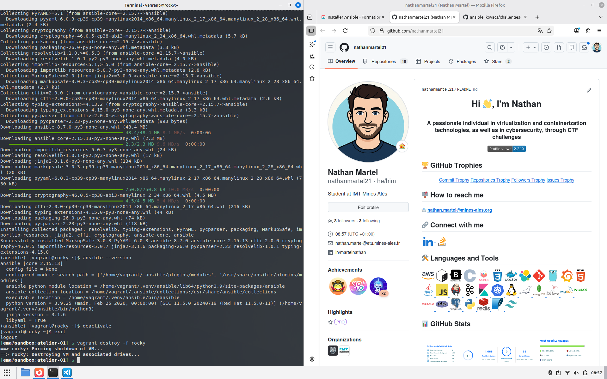

# Atelier-01 : Installation d’Ansible sur un Control Host (Rocky Linux + Virtualenv)

⚠️ **Ce document est classifié sous TLP: RED**

---

## Description

Ce troisième challenge illustre l’installation d’Ansible sur un Control Host Rocky Linux en utilisant **PIP** et un environnement python isolé créé avec `virtualenv` (module standard de python sur Rocky). Cette méthode est utile lorsqu’aucun paquet natif n’est disponible ou qu’une version plus récente est souhaitée.

> Contrairement à Debian, il n’est pas nécessaire d’installer le paquet `python3-venv` : la bibliothèque `venv` fait déjà partie de la distribution.

## Démarrage de la machine virtuelle

Je me suis placé dans le répertoire `atelier-01` puis j’ai lancé la VM Rocky :

```bash
$ vagrant up rocky
```

## Connexion à la machine virtuelle

```bash
$ vagrant ssh rocky
```

## Mise à jour des dépôts

Je mets à jour les informations APT :

```bash
$ sudo dnf update -y
```

## Installation de pip

Rocky Linux ne fournit pas pip par défaut ; je l’ai ajouté via dnf :

```bash
$ sudo dnf install -y python3-pip
```

## Création de l’environnement virtuel

Le module `venv` étant intégré, j’ai créé un environnement local personnel :

```bash
$ python3 -m venv ~/.venv/ansible
```

Puis je l’ai activé :

```bash
$ source ~/.venv/ansible/bin/activate
```

## Mise à jour de pip et installation d’Ansible

```bash
(ansible) $ pip install --upgrade pip
(ansible) $ pip install ansible
```

L’installation télécharge plusieurs dépendances python ; au terme, Ansible core 2.15.13 et ansible 8.7.0 étaient présents.

## Vérification de l’installation

Toujours dans l’environnement virtuel, j’ai interrogé la version :

```bash
(ansible) $ ansible --version
```

Sortie obtenue :



L’usage d’un environnement virtuel garantit que le système hôte reste propre et évite tout conflit avec des paquets python globaux.

## Nettoyage

J’ai désactivé l’environnement :

```bash
(ansible) $ deactivate
```

puis quitté la VM :

```bash
$ exit
```

et enfin supprimé la machine :

```bash
$ vagrant destroy -f rocky
```

## Auteur

> @uthor : Nathan Martel, étudiant en deuxième année à l'École des Mines
d'Alès.

---

**TLP: RED** - Ce document markdown est classifié sous la marque TLP: RED
